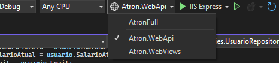
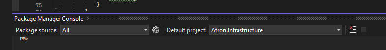
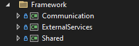
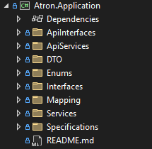
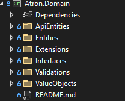
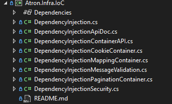
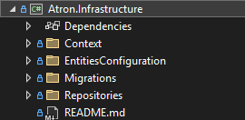

<!DOCTYPE html>
<html>
<head>
</head>
<body>

<h1>Projeto Atron Tracker</h1>

Esse protótipo tem como objetivo exemplificar todo o desenvolvimento e ciclo de um software. O projeto apresentado segue os padrões da Arquitetura Limpa com aplicação parcial do Domain-Driven Design (DDD) e MVC. As bases desse projeto foram desenvolvidas para desktop; no entanto, devido aos conhecimentos adquiridos após exercer minha função na área e dos estudos realizados, estou constanemente refatorando e melhorando o sistema.

 

  <h2>Como configurar?</h2>
  
 Para configurar e inicializar o sistema será necessário utilizar o Visual Studio Code ou instalar o Visual Studio 2022 na sua máquina.

  Feita a instalação, configure o projeto inicial para o WebApi:   

  Em seguida, abra o Package Manager Console e digite <i>update-database</i> isso irá instalar e inicializar o banco de dados do projeto. Além disso você precisa configurar o projeto padrão para o <i>Atron.Infrastructure</i> pois as configurações de acesso a dados e das entidades estão concentradas nesse módulo.
  
  

  <h2>Como funciona?</h2>
  
 O projeto (até o momento) pode ser usado de duas formas: 
    <ul>
        <li>
          <b>Web Api</b>
            
 O projeto de Api é a parte principal do sistema onde foi configurado os endpoints de acesso para cada módulo do sistema.
            

            
 É nesse projeto que se concentra as principais regras de negócio e validações.

            
 Você pode utilizar todo o sistema apenas com esse módulo mesmo que o projeto Web View não seja inicializado.

       </li>
       
      <li>
          <b>Web View</b>
            
 O projeto da View é onde ocorre os processos mais variados para a apresentação e o envio dos dados para a API.
            

            
 É nesse projeto que se concentra a comunicação com a API, a configuração dos serviços externos e das View Models.
            

            
Por enquanto esse módulo depende do projeto de API para funcionar, ou seja, você não vai conseguir utilizá-lo sozinho. No entanto, com as novas atualizações deixarei um modo "API-Off" para ser utilizado.

       </li>
    </ul>
  

 

<h2>Estrutura dos Projetos</h2>

Nesse tópico irei explicar de forma detalhada cada módulo, componente e classes apresentando seus funcionamentos e responsabilidades.

<ul>
  <li>
    <h3>Framework</h3>
    
Decidi modelar e montar a estrutura interna dos processos e fluxos do sistema por conta própria, apesar de ter outras abordagens que poderiam ser utilizadas. No entanto, para me desafiar, centralizei tudo nessa pasta a fim de organizar as bibliotecas do fluxo do sistema.

    
    <ul>
      <li>
        
<strong> <link href="/Framework/Communication/README.md">Communication:</link></strong> Gerencia a comunicação dentro da aplicação, incluindo serviços de envio de e-mails, notificações, mensagens de texto, ou qualquer outro tipo de comunicação necessária.

      </li> 
            
      <li>
        
<strong>ExternalServices:</strong> Responsável pela integração com serviços externos, conectando a aplicação com APIs de terceiros ou serviços como gateways de pagamento, serviços de autenticação, ou APIs de dados.
       
        
No entanto, esse módulo é responsável por abstrair a comunicação com o projeto de Web API, em outras palavras, é ele quem faz o processamento de envio e recebimento dos dados da view para a API.

      </li>
       
      <li>
        
<strong>Notification:(obsoleto)</strong> Gerencia notificações dentro da aplicação, incluindo envio de alertas, gerenciamento de status das notificações e definição de regras para disparo de notificações.

      </li>
       
      <li>
        
<strong>Shared:</strong> Contém código compartilhado entre diferentes módulos ou camadas da aplicação, como utilitários, helpers e outras classes reutilizáveis.

      </li>
    </ul>
  </li>

  <li>
    <h3>Atron.Application</h3>
    
    
Contém a lógica de aplicação, como regras de negócios, validações, e manipulação de dados específicos do domínio. Esta camada coordena a execução de tarefas entre diferentes camadas, gerencia casos de uso, e orquestra o funcionamento geral da aplicação.

  </li>

  <li>
    <h3>Atron.Domain</h3>
    
    
Representa a camada de domínio, incluindo entidades principais, regras de negócios essenciais, objetos de valor, e serviços de domínio. Esta camada define os conceitos fundamentais e operações dentro do domínio da aplicação.

  </li>

  <li>
    <h3>Atron.Infra.IoC</h3>
    
    
Responsável pela Injeção de Dependência (IoC - Inversion of Control). Este projeto configura e gerencia a injeção de dependências através de contêineres, permitindo que os diferentes componentes da aplicação sejam desacoplados e testáveis.

  </li>

  <li>
    <h3>Atron.Infrastructure</h3>
    
    
Trata das preocupações de infraestrutura, como o acesso a dados (implementações de repositório), serviços externos, e qualquer outra operação que interaja com o mundo externo ou que suporte as camadas superiores. Contém implementações concretas para interfaces definidas na camada de domínio.

  </li>

  <li>
    <h3>Atron.WebApi</h3>
    
A camada de interface da Web para a sua aplicação, expondo APIs RESTful ou endpoints que podem ser consumidos por clientes front-end ou outros serviços. Manipula solicitações HTTP, validações de entrada, autenticação, e retorna respostas apropriadas aos clientes.

  </li>

  <li>
    <h3>Atron.WebViews</h3>
    
Focado na interface do usuário, este projeto inclui páginas da web, layouts, e componentes visuais que compõem a interface da sua aplicação. Pode ser um front-end MVC, Razor Pages, ou outra abordagem para renderização de conteúdo dinâmico para os usuários finais.

  </li>
</ul>

</body>
</html>
