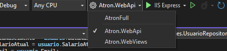
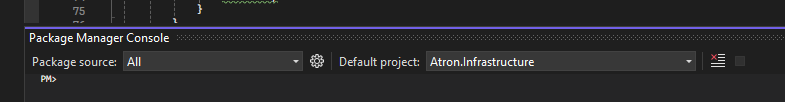
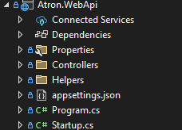
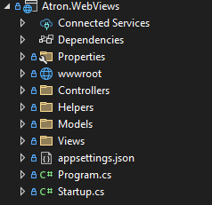

# 🚀 Projeto Atron Tracker

Bem-vindo ao **Atron Tracker**! Este projeto é um protótipo robusto projetado para demonstrar o ciclo completo de desenvolvimento de software, aplicando práticas modernas de arquitetura e design.


---

## 📖 Sobre o Projeto

O **Atron Tracker** segue os princípios da **Arquitetura Limpa (Clean Architecture)**, com aplicação parcial de **Domain-Driven Design (DDD)** e **MVC**. Embora as bases tenham sido desenvolvidas inicialmente para desktop, o sistema está em constante evolução, incorporando novos conhecimentos e refatorações para garantir qualidade e escalabilidade.

### 🌟 Destaques

- **Arquitetura Desacoplada**: Facilita a manutenção e a substituição de componentes (ex: ORM, Banco de Dados).
- **Documentação Automática**: Uso do Swagger e Redoc para uma documentação de API clara e interativa.
- **Mapeamento Personalizado**: Implementação de um mapeador próprio para DTOs e Entidades.
- **Flexibilidade**: Banco de dados SQL Server e ORM Entity Framework Core configurados, mas facilmente substituíveis.

---

## 🛠️ Tecnologias Utilizadas

| Tecnologia                | Descrição                                |
| ------------------------- | ---------------------------------------- |
| **.NET 8**                | Plataforma base para o desenvolvimento.  |
| **Entity Framework Core** | ORM para manipulação de dados.           |
| **SQL Server**            | Banco de dados relacional.               |
| **Swagger / Redoc**       | Documentação da API.                     |
| **Angular**               | Framework para o Web View (em migração). |

> **Nota**: O projeto Web View está sendo migrado para Angular. Confira o repositório aqui: [Atron Tracker Web View](https://github.com/Queiroz-Dv/AtronTracker-WebView)

---

## ⚙️ Como Configurar

Siga os passos abaixo para configurar e rodar o projeto em sua máquina:

1. **Pré-requisitos**:

   - Visual Studio 2022 ou Visual Studio Code.
   - .NET SDK instalado.
   - SQL Server instalado.

2. **Configuração Inicial**:

   - Abra a solução no Visual Studio.
   - Defina o projeto **Atron.WebApi** como projeto de inicialização.

   

3. **Banco de Dados**:

   - Abra o **Package Manager Console (PMC)**.
   - Defina o projeto padrão como `Atron.Infrastructure`.
   - Execute o comando:
     ```powershell
     update-database
     ```

   

---

## 🧩 Como Funciona?

O sistema é dividido em módulos principais:

### 🌐 Web Api

A espinha dorsal do sistema. Centraliza as regras de negócio, validações e endpoints.

- **Independência**: Pode ser utilizado isoladamente.
- **Segurança**: Gerencia autenticação e autorização.



### 💻 Web View (Razor Pages / Angular)

A interface do usuário. Responsável pela apresentação e interação com o usuário.

- **Comunicação**: Consome a API para exibir e enviar dados.
- **Dependência**: Necessita da API rodando para funcionar plenamente.



---

## 🏗️ Estrutura dos Projetos

Abaixo, uma visão geral dos módulos e suas responsabilidades:

### 📂 Framework

Núcleo compartilhado e utilitários do sistema.

- **[Communication](/Framework/Communication/README.md)**: Gerencia chamadas HTTP e tokens.
- **[External Services](/Framework/ExternalServices/README.md)**: Abstração para comunicação com a API.
- **[Shared](/Framework/Shared/README.md)**: Utilitários e helpers globais.

### 📂 Camadas da Aplicação

- **[Atron.Application](/Atron.Application/README.md)**: Orquestração de tarefas e casos de uso.
- **[Atron.Domain](/Atron.Domain/README.md)**: O coração do sistema. Entidades, interfaces e regras de negócio.
- **[Atron.Infrastructure](/Atron.Infrastructure/README.md)**: Implementação de repositórios e acesso a dados.
- **[Atron.Infra.IoC](/Atron.Infra.IoC/README.md)**: Configuração de Injeção de Dependência.
- **Atron.WebApi**: Interface RESTful.
- **Atron.WebViews**: Interface de Usuário.

---

Feito com ❤️ por [Queiroz-Dv](https://github.com/Queiroz-Dv)
