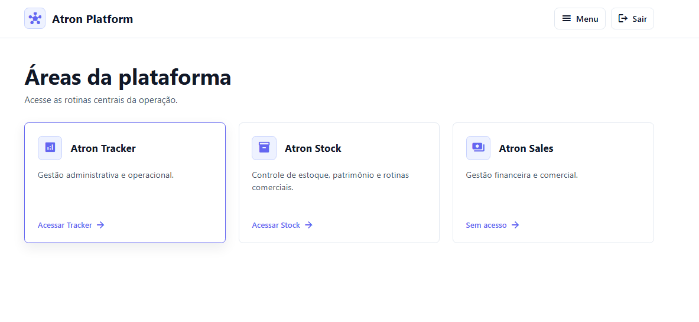
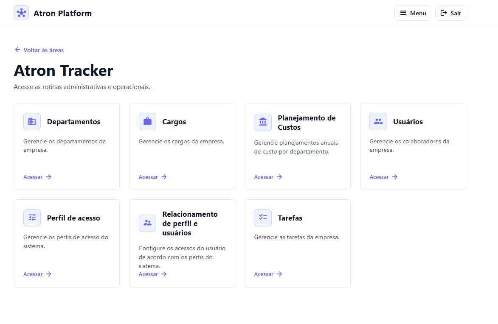
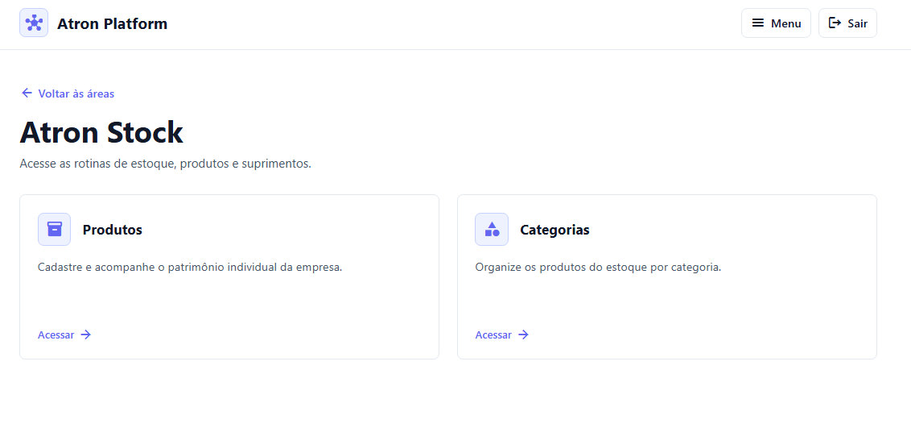
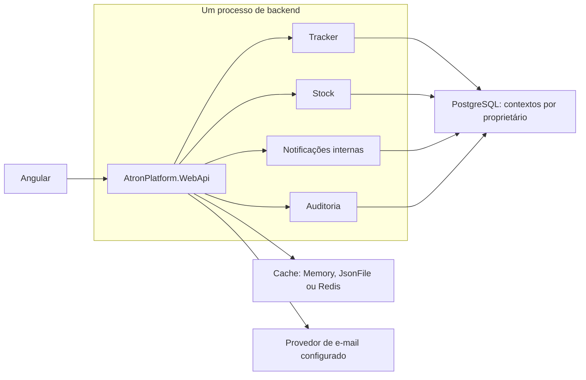

# Atron Platform

O Atron é uma plataforma de gestão para negócios locais e pequenos empresários. A proposta é reunir rotinas administrativas, patrimônio e, futuramente, operações comerciais em um produto de porte enxuto.

O projeto está em desenvolvimento e também serve como formação prática em arquitetura, implementação, testes e manutenção de software. A documentação diferencia as funcionalidades existentes da direção de evolução do produto.

**Comece por aqui:** [roteiro de avaliação](docs/guia-avaliacao.md) · [execução local](docs/desenvolvimento/execucao-local.md) · [índice da documentação](docs/README.md) · [como contribuir](CONTRIBUTING.md).

## O que está disponível

| Área | Responsabilidade | Estado atual |
| --- | --- | --- |
| **Atron Tracker** | Gestão administrativa e operacional. | Rotinas de departamentos, cargos, usuários, perfis de acesso, relacionamento entre perfis e usuários, tarefas e planejamento de custos. |
| **Atron Stock** | Produtos, patrimônio e estoque. | Produtos patrimoniais e categorias disponíveis na navegação; geração de produtos em lote com acompanhamento de processamento. O restante do fluxo de estoque está em evolução. |
| **Atron Sales** | Operações comerciais e financeiras. | Área planejada, com acesso desabilitado na configuração atual da interface. |

A plataforma também reúne autenticação e autorização, auditoria, notificações internas, envio de e-mail e cache configurável. A disponibilidade de cada rotina depende das permissões do usuário e da configuração do ambiente.

O Stock ainda contém estruturas e endpoints de entrada e venda do modelo anterior. Sua existência não significa que o novo fluxo patrimonial ou a integração com Sales estejam concluídos. Os limites estão detalhados no [guia do Stock](AtronPlatform/Modules/Stock/README.md).

## Conheça a interface

As capturas abaixo foram fornecidas pelo mantenedor. Elas apresentam a organização da interface, não substituem testes das operações e podem mostrar menos opções que outra conta com permissões diferentes.

### Áreas da plataforma

O ponto de entrada organiza o produto em Tracker, Stock e Sales. Na captura, Sales aparece como “Sem acesso”; a configuração atual também mantém essa área desabilitada.

### Atron Tracker

A área administrativa reúne a estrutura da empresa, os acessos dos colaboradores, as tarefas e o planejamento de custos por departamento.

### Atron Stock

A entrada do Stock apresenta Produtos e Categorias. O cadastro de Produto representa um bem individual; o formulário também permite solicitar a geração de vários bens por lote.

## Arquitetura em uma visão

O backend adota um **monólito modular**, publicado por um único host, `AtronPlatform.WebApi`. Tracker e Stock preservam suas camadas e propriedade sobre os dados. Auditoria e notificações são capacidades transversais. O Angular é a aplicação de interface, executada e publicada separadamente.

```mermaid
flowchart LR
    Front["Angular"] --> API["AtronPlatform.WebApi"]
    subgraph Backend["Um processo de backend"]
        API --> Tracker["Tracker"]
        API --> Stock["Stock"]
        API --> Notificacoes["Notificações internas"]
        API --> Auditoria["Auditoria"]
    end
    Tracker --> Banco["PostgreSQL: contextos por proprietário"]
    Stock --> Banco
    Notificacoes --> Banco
    Auditoria --> Banco
    API --> Cache["Cache: Memory, JsonFile ou Redis"]
    API --> Email["Provedor de e-mail configurado"]
```

O diagrama resume a composição da plataforma; não representa todas as chamadas internas. Sales ainda não aparece como módulo implementado no host.

| Tecnologia | Uso no repositório |
| --- | --- |
| .NET 9 e ASP.NET Core | Host e APIs do backend. |
| Entity Framework Core e PostgreSQL | Persistência, com contextos e migrations por proprietário. Supabase é o provedor documentado para publicação. |
| Angular 19 e Angular Material | Interface em `AtronFront`. |
| Memory, JsonFile e Redis | Opções de cache; Redis/Render Key Value é a opção distribuída documentada. |
| Swagger e ReDoc | Documentação HTTP habilitada em desenvolvimento. |
| GitHub Actions | Compilação, testes .NET e build do frontend. |

Consulte as decisões sobre [host único](docs/adr/transversais/0007-adotar-monolito-modular-com-host-neutro.md), [notificações internas](docs/adr/transversais/0008-incorporar-notificacoes-internas-ao-host-da-plataforma.md), [cache](docs/adr/transversais/0009-adotar-redis-como-cache-distribuido.md) e [produto patrimonial](docs/adr/stock/0011-modelar-produto-patrimonial.md).

As notificações internas são consultadas por HTTP sob demanda. SignalR e um broker de mensageria não fazem parte dessa implementação atual; uma evolução para tempo real precisa de definição própria.

## Como explorar e executar

Para executar localmente:

1. Abra `AtronPlatform.sln` no Visual Studio e selecione `AtronPlatform.WebApi` como projeto de inicialização.
2. Prepare um PostgreSQL de desenvolvimento, seu esquema e um usuário autorizado. Configure conexão e segredos fora do versionamento.
3. Inicie o perfil `AtronPlatform.WebApi`; a API de desenvolvimento usa `https://localhost:7280`.
4. Em `AtronFront`, execute `npm ci` e `npm start`.

O [guia de execução local](docs/desenvolvimento/execucao-local.md) detalha os pré-requisitos, as configurações e os limites desse roteiro. Iniciar a aplicação não cria automaticamente uma base pronta para demonstração.

## Testes e integração contínua

O [workflow de CI](.github/workflows/ci.yml) restaura e testa a solução .NET e compila o Angular em configuração de produção. O job `Qualidade` exige sucesso das duas etapas. O selo acima acompanha a `main`, não alterações locais ainda em revisão.

Os testes estão em `Tests`: `Platform.Tests`. Consulte a [organização dos testes](docs/arquitetura-testes.md).

A CI atual não executa a suíte Jasmine do frontend nem uma navegação autenticada completa. Build e testes automatizados não comprovam, por si só, o funcionamento do banco, das credenciais ou do deploy.

## Como contribuir e publicar

O fluxo documentado usa `main` como base de integração e `RC2` como branch ligada à publicação no Render. As mudanças passam por branches de trabalho, revisão e validação antes da integração. Publicar uma release é uma etapa distinta de concluir uma funcionalidade.

- [Contribuição e critérios de conclusão](CONTRIBUTING.md).
- [Branches e trabalho pelo Visual Studio](docs/desenvolvimento/fluxo-git.md).
- [Versões, tags e release notes](docs/operacao/releases.md).
- [Changelog](CHANGELOG.md) e [notas de versão](docs/releases/README.md).

A notificação de novidades dentro do sistema é uma evolução descrita no fluxo de releases, ainda não uma entrega dessa documentação.

## Onde encontrar cada parte

| Caminho | Conteúdo |
| --- | --- |
| [AtronFront](AtronFront/README.md) | Interface Angular, navegação e consumo das APIs. |
| `AtronPlatform/WebApi` | Host único, configuração e controllers HTTP. |
| `AtronPlatform/Modules/Tracker` | Domain, Application e Infrastructure do Tracker. |
| [AtronPlatform/Modules/Stock](AtronPlatform/Modules/Stock/README.md) | Domain, Application e Infrastructure do Stock. |
| [Framework/Shared](Framework/Shared/README.md) | Contratos e componentes compartilhados. |
| `Framework/AtronNotificacoes` | Aplicação, persistência e contratos das notificações. |
| `Tests` | Projetos de testes automatizados. |
| [docs](docs/README.md) | Produto, decisões, desenvolvimento e operação. |

## Configuração e histórico

Credenciais não devem ser commitadas. Use variáveis de ambiente ou configuração local não versionada. Os guias de [execução local](docs/desenvolvimento/execucao-local.md), [publicação com Render, Supabase e Brevo](docs/publicacao-render-brevo-supabase.md) e [cache Redis](docs/cache-redis.md) descrevem as opções.

O projeto evoluiu de SQL Server e de uma interface MVC/Razor para PostgreSQL e Angular. Esses elementos históricos não são a pilha ativa do produto. O [CONTEXT.md](CONTEXT.md), a [visão de produto](docs/visao-produto-atron.md) e os [ADRs](docs/adr/README.md) registram os contratos e as razões das decisões.
