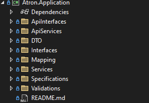
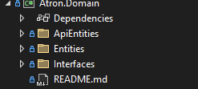
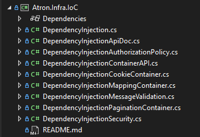

<!DOCTYPE html>
<html>
<head>
</head>
<body>

<h1>Projeto Atron Tracker</h1>

Esse protótipo tem como objetivo exemplificar todo o desenvolvimento e ciclo de um software. 
O projeto apresentado segue os padrões da Arquitetura Limpa com 
aplicação parcial do Domain-Driven Design (DDD) e MVC. 
As bases desse projeto foram desenvolvidas para desktop; no entanto, 
devido aos conhecimentos adquiridos após exercer minha função na área e dos estudos realizados, 
estou constanemente refatorando e melhorando o sistema.

 

  <h2>Tecnologias Utilizadas</h2>
  
Para o projeto Web Api utilizei o Swagger para documentação além do Redoc para um layout mais apresentável.
    No projeto anterior utilizei o AutoMapper para lidar com os mapeamentos do DTO para entidade, no entanto, decidi montar meu próprio mapeador.

  
O ORM utilizado é o Entity Framework Core, e está desacoplado das outras camadas podendo ser alterado por outro ORM de preferência.

  
O projeto de web view está habilitado para a utilização de Razor Pages, no entanto, ainda espero alterar para o Angular futuramente.

  
O banco de dados utilizado é o SQL Server, assim como o ORM também pode ser alterado facilmente pois está desacoplado.

  <h2>Como configurar?</h2>
  
 Para configurar e inicializar o sistema será necessário utilizar o Visual Studio Code ou instalar o Visual Studio 2022 na sua máquina.

  Feita a instalação, configure o projeto inicial para o WebApi:   

  Em seguida, abra o Package Manager Console e digite <i>update-database</i> isso irá instalar e inicializar o banco de dados do projeto. Além disso você precisa configurar o projeto padrão para o <i>Atron.Infrastructure</i> pois as configurações de acesso a dados e das entidades estão concentradas nesse módulo.
  
  

  <h2>Como funciona?</h2>
  
 O projeto (até o momento) pode ser usado de duas formas: 
    <ul>
        <li>
          <b>Web Api</b>
             

            
 O projeto de Api é a parte principal do sistema onde foi configurado os endpoints de acesso para cada módulo.            
              É nesse projeto que se concentra as principais regras de negócio e validações.
             Pode-se utilizar todo o sistema apenas com esse módulo mesmo que o projeto Web View não seja inicializado.

       </li>
       
      <li>
          <b>Web View</b>
           

            
 O projeto da View é onde ocorre os processos mais variados para a apresentação e o envio dos dados para a API.
            É nesse projeto que se concentra a comunicação com a API, 
            a configuração dos serviços externos e das View Models.           
            Por enquanto esse módulo depende do projeto de API para funcionar, ou seja, 
            não vai há possibilidade de utilizá-lo sozinho.
       </li>
    </ul>
  

 

<h2>Estrutura dos Projetos</h2>

Nesse tópico irei explicar de forma resumida cada módulo, componente e classes apresentando seus funcionamentos e responsabilidades.

Para verificar mais informações você pode clicar no link de cada tópico.

<ul>
  <li>
    <h3>Framework</h3>
    

    
Decidi modelar e montar a estrutura interna dos processos e fluxos do sistema por conta própria, 
      apesar de ter outras abordagens para utilizar. 
      No entanto, para desafiar-me, centralizei tudo nessa pasta a fim de organizar 
      as bibliotecas do fluxo do sistema.
    
    <ul>
      <li>
        
<strong><a title="Communication Doc" href="/Framework/Communication/README.md">Communication:</a></strong>
        

        Gerencia a comunicação com as rotas da API e do token de acesso entre os endpoints, além de abstrair uma parte da segurança para a API.
         
      </li> 
            
      <li>
        
<strong><a title="External Services Doc" href="/Framework/ExternalServices/README.md">External Services:</a></strong>  
        
Esse módulo é responsável por abstrair a comunicação com o projeto de Web API, em outras palavras,
            é ele quem faz o processamento de envio e recebimento dos dados da view para a API.
        
        
 É um módulo especificamente separado para lidar com as requisições HTTP, 
            incluindo funcionalidades para as págians de Login e de Registro.
        

      </li>          
      <li>
        
<strong><a title="Shared Doc" href="/Framework/Shared/README.md">Shared</a>:</strong>  
         Contém código compartilhado entre diferentes módulos ou camadas da aplicação, como utilitários, helpers e outras classes reutilizáveis.

      </li>
    </ul>
  </li>

  <li>
    <h3><a title="Atron Application Doc" href="/Atron.Application/README.md">Atron.Application</a></h3>
    
    
Contém a lógica de aplicação, como regras de negócios, validações, e manipulação de dados específicos do domínio. Esta camada coordena a execução de tarefas entre diferentes camadas, gerencia casos de uso, e orquestra o funcionamento geral da aplicação.

  </li>

  <li>
    <h3><a title="Atron Domain Doc" href="/Atron.Domain/README.md">Atron.Domain</a></h3>
    
    
Representa a camada de domínio, incluindo entidades principais. Esta camada define os conceitos fundamentais e operações dentro do domínio da aplicação. Além de definir as interfaces para a camada de dados.

  </li>

  <li>
    <h3><a title="Atron Infra IoC Doc" href="/Atron.Infra.IoC/README.md">Atron.Infra.IoC</a></h3>
    
    
Responsável pela Injeção de Dependência (IoC - Inversion of Control). 
    Este projeto configura e gerencia a injeção de dependências através de contêineres, 
    permitindo que os diferentes componentes da aplicação sejam desacoplados e testáveis.

  </li>

  <li>
    <h3><a title="Atron Infrastructure Doc" href="/Atron.Infrastructure/README.md">Atron.Infrastructure</a></h3>
    
    
Trata das preocupações de infraestrutura, como o acesso a dados (implementações de repositório), serviços externos, e qualquer outra operação que interaja com o mundo externo ou que suporte as camadas superiores. Contém implementações concretas para interfaces definidas na camada de domínio.

  </li>

  <li>
    <h3>Atron.WebApi</h3>
    
A camada de interface da Web para a sua aplicação, expondo APIs RESTful ou endpoints que podem ser consumidos por clientes front-end ou outros serviços. Manipula solicitações HTTP, validações de entrada, autenticação, e retorna respostas apropriadas aos clientes.

  </li>

  <li>
    <h3>Atron.WebViews</h3>
    
Focado na interface do usuário, este projeto inclui páginas da web, layouts, e componentes visuais que compõem a interface da sua aplicação. Pode ser um front-end MVC, Razor Pages, ou outra abordagem para renderização de conteúdo dinâmico para os usuários finais.

  </li>
</ul>
</body>
</html>