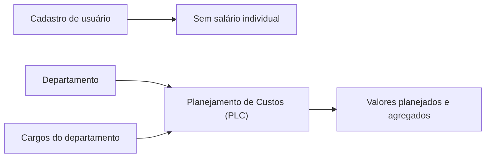

# ADR 0001: Substituir salários por planejamento de custos

## Status

Aceito.

## Contexto

O módulo de salários tratava valores remuneratórios individuais como parte do cadastro de usuários. Essa abordagem ampliava a exposição de dados sensíveis e não representava a necessidade de produto: planejar custos futuros de uma estrutura, e não reutilizar salários históricos como projeção automática.

O novo módulo precisa trabalhar com valores agregados por departamento e pelos cargos vinculados a esse departamento. O código canônico escolhido para essa capacidade é `PLC`.

## Decisão

O módulo de salários será removido e substituído pelo módulo de Planejamento de Custos.

A substituição seguirá estas regras:

- dados remuneratórios individuais deixam de fazer parte do cadastro de usuários;
- registros, permissões e código do módulo de salários serão removidos;
- valores individuais antigos não serão migrados nem usados como base automática;
- o planejamento será definido por departamento e pelos cargos pertencentes a ele;
- a relação entre cargo e departamento será validada antes da persistência;
- relatórios do planejamento não devem reintroduzir salário individual como dado operacional comum.

## Alternativas consideradas

### Reaproveitar salários individuais como valor inicial

Rejeitada porque confundiria dado histórico sensível com decisão de planejamento e criaria uma migração sem regra de negócio aprovada.

### Manter os dois módulos

Rejeitada porque preservaria conceitos concorrentes, permissões duplicadas e uma fonte ambígua para os custos de pessoal.

### Planejar apenas por departamento

Rejeitada porque impediria detalhar a composição do custo pelos cargos vinculados à estrutura.

## Consequências

- o código `PLC` passa a identificar o módulo de Planejamento de Custos;
- usuários deixam de armazenar salário individual no cadastro;
- o novo módulo precisa validar a estrutura departamento/cargo;
- qualquer migração deve remover referências ao módulo antigo sem transportar valores remuneratórios;
- acesso a relatórios detalhados continuará sujeito às políticas do módulo.

## Validação

- não deve restar módulo, permissão ou fluxo operacional identificado como salários;
- o cadastro de usuários não deve expor salário individual;
- planejamentos devem aceitar somente cargos pertencentes ao departamento informado;
- builds e testes dos módulos afetados devem passar após a remoção.
