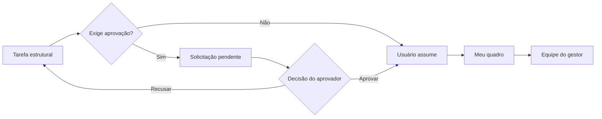

# ADR 0002: Remodelar tarefas com gestão e notificações internas

## Status

Aceito.

## Contexto

O módulo de tarefas nasceu como uma listagem geral de tarefas atribuídas diretamente a usuários. Esse modelo mistura responsabilidade pessoal, acompanhamento de equipe e decisões de aprovação, além de exigir carregamentos amplos para responder a contextos diferentes.

O produto precisa representar tarefas individuais e tarefas vinculadas a uma estrutura funcional. Também precisa permitir que usuários obtenham tarefas disponíveis, que gestores decidam solicitações e que eventos importantes sejam comunicados dentro do próprio sistema.

## Decisão

### Visões de trabalho

A experiência será organizada em três visões:

| Visão | Responsabilidade |
|---|---|
| `Meu quadro` | Tarefas ativas atribuídas diretamente ao usuário logado. |
| `Equipe` | Tarefas dos subordinados diretos acompanhados pelo gestor. |
| `Solicitações` | Pedidos pendentes de obtenção que exigem decisão de um aprovador. |

### Destino e escopo

Uma tarefa poderá nascer com destino inicial para `Usuário`, `Departamento/Cargo` ou `Equipe`.

- uma tarefa estrutural pode apontar somente para departamento ou para departamento e cargo;
- cargo sem departamento não é permitido;
- uma tarefa sem usuário responsável permanece em uma fila estrutural;
- o identificador funcional será numérico, sequencial e global, separado do ID técnico.

### Obtenção e aprovação

Quando uma tarefa não exigir aprovação, um usuário autorizado poderá assumi-la diretamente. Quando exigir aprovação, o sistema criará uma solicitação para um aprovador válido.

Obter, aprovar ou recusar uma solicitação não altera o estado operacional da tarefa. A exigência de aprovação pertence ao processo de obtenção, não ao ciclo de execução.

A resolução de aprovador seguirá esta ordem:

1. gestor imediato do solicitante;
2. gestor do departamento da tarefa;
3. gestores dos departamentos vinculados ao solicitante, sem prioridade de negócio entre eles.

Códigos repetidos serão considerados uma única vez. Entre os gestores dos departamentos do solicitante, o código do departamento será usado somente como critério técnico de ordenação determinística, sem representar preferência de negócio.

Se nenhum aprovador válido existir, a solicitação será bloqueada no backend.

### Histórico e carregamento

Tarefas finalizadas ou canceladas ficam fora do carregamento padrão. Elas aparecem somente por filtro explícito ou busca autorizada e permanecem preservadas para consulta histórica.

### Notificações

A central de notificações internas será o canal principal para eventos operacionais. As notificações devem permitir controle de leitura e navegação ao detalhe relacionado quando aplicável. E-mail será usado somente em situações específicas de comunicação externa ou aviso complementar.

## Alternativas consideradas

### Manter toda tarefa atribuída a um único usuário

Rejeitada porque impediria filas por estrutura, obtenção de tarefas e gestão por equipe.

### Usar e-mail como principal meio de aprovação

Rejeitada porque deslocaria a decisão operacional para fora do produto. `Solicitações` e a central interna permanecem como fontes principais.

### Tratar pendência de aprovação como estado da tarefa

Rejeitada porque misturaria o processo de obtenção com o ciclo de execução.

## Consequências

- usuários podem possuir gestor imediato opcional;
- departamentos podem possuir, no máximo, um gestor ativo;
- tarefas passam a aceitar usuário, departamento e cargo como vínculos opcionais e coerentes;
- solicitações de obtenção passam a ter ciclo próprio;
- consultas devem carregar apenas a visão necessária ao contexto;
- o módulo de notificações internas torna-se uma capacidade própria do produto.

## Validação

- `Meu quadro`, `Equipe` e `Solicitações` devem possuir consultas separadas;
- tarefa estrutural nunca pode possuir cargo sem departamento;
- uma tarefa não pode ter mais de uma solicitação pendente de obtenção;
- obter ou decidir solicitação não pode alterar o estado operacional;
- tarefas finalizadas e canceladas não aparecem por padrão;
- falha de notificação consultiva não desfaz a operação principal.
