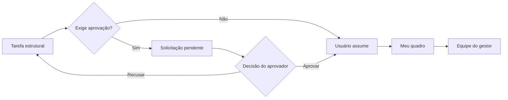

# ADR 0002: Remodelar tarefas com gestão e notificações internas

## Status

Aceito.

## Contexto

O módulo de tarefas nasceu como uma listagem geral de tarefas atribuídas diretamente a usuários. Esse modelo mistura responsabilidade pessoal, acompanhamento de equipe e decisões de aprovação, além de exigir carregamentos amplos para responder a contextos diferentes.

O produto precisa representar tarefas individuais e tarefas vinculadas a uma estrutura funcional. Também precisa permitir que usuários obtenham tarefas disponíveis, que gestores decidam solicitações e que eventos importantes sejam comunicados dentro do próprio sistema.

## Decisão

### Visões de trabalho

A experiência será organizada em quatro visões:

| Visão | Responsabilidade |
|---|---|
| `Meu quadro` | Tarefas ativas atribuídas diretamente ao usuário logado. |
| `Disponíveis` | Tarefas ativas sem usuário responsável que podem ser consultadas por qualquer usuário com acesso ao módulo. |
| `Equipe` | Tarefas dos subordinados diretos acompanhados pelo gestor. |
| `Solicitações` | Pedidos pendentes de obtenção que exigem decisão de um aprovador. |

Usuários sem responsabilidade de gestão visualizam somente `Meu quadro` e `Disponíveis`. `Equipe` e `Solicitações` ficam disponíveis para usuários que possuam subordinados diretos ou sejam gestores de departamento.

### Destino e escopo

Uma tarefa poderá nascer com destino inicial para `Usuário`, `Departamento/Cargo` ou `Equipe`.

- uma tarefa estrutural pode apontar somente para departamento ou para departamento e cargo;
- cargo sem departamento não é permitido;
- uma tarefa sem usuário responsável permanece em uma fila estrutural;
- o identificador funcional será numérico, sequencial e global, separado do ID técnico.

### Obtenção e aprovação

Usuários sem responsabilidade de gestão podem visualizar as tarefas disponíveis, mas sempre precisam criar uma solicitação para um aprovador válido. Usuários com responsabilidade de gestão podem assumir diretamente uma tarefa que não exija aprovação. Quando a tarefa exigir aprovação, gestores também precisam criar uma solicitação.

A solicitação, a obtenção direta e a recusa não alteram o estado operacional da tarefa. Quando o aprovador aceita uma solicitação de uma tarefa em `Pendente de aprovação`, a tarefa passa para `Iniciada` e o flag de exigência de aprovação para obtenção é desmarcado. A aprovação de tarefas em outros estados preserva tanto o estado quanto o flag.

A resolução de aprovador seguirá esta ordem:

1. gestor imediato do solicitante;
2. gestor do departamento da tarefa;
3. gestores dos departamentos vinculados ao solicitante, sem prioridade de negócio entre eles.

Códigos repetidos serão considerados uma única vez. Entre os gestores dos departamentos do solicitante, o código do departamento será usado somente como critério técnico de ordenação determinística, sem representar preferência de negócio.

Se nenhum aprovador válido existir, a solicitação será bloqueada no backend.

### Histórico e carregamento

Tarefas finalizadas ou canceladas ficam fora do carregamento padrão. Elas aparecem somente por filtro explícito ou busca autorizada e permanecem preservadas para consulta histórica.

O módulo mantém um histórico cronológico e imutável das movimentações da tarefa. A implementação registra criação, atualização, obtenção direta, solicitação de obtenção, aprovação e recusa; transições como início, entrega e finalização são preservadas nos detalhes da atualização. Cada registro mantém o código e o nome do ator como fotografia do momento da ação, a data e hora e as mudanças relevantes. A consulta usa paginação no servidor, é carregada sob demanda em uma caixa expansível no detalhe da tarefa e respeita o acesso do usuário responsável, das equipes e dos gestores.

### Notificações

A central de notificações internas será o canal principal para eventos operacionais. As notificações devem permitir controle de leitura e navegação ao detalhe relacionado quando aplicável. E-mail será usado somente em situações específicas de comunicação externa ou aviso complementar.

## Alternativas consideradas

### Manter toda tarefa atribuída a um único usuário

Rejeitada porque impediria filas por estrutura, obtenção de tarefas e gestão por equipe.

### Usar e-mail como principal meio de aprovação

Rejeitada porque deslocaria a decisão operacional para fora do produto. `Solicitações` e a central interna permanecem como fontes principais.

### Alterar automaticamente qualquer estado ao obter a tarefa

Rejeitada porque tornaria a obtenção responsável por transições operacionais não relacionadas. A única transição automática aceita é de `Pendente de aprovação` para `Iniciada` após a aprovação efetiva da solicitação.

## Consequências

- usuários podem possuir gestor imediato opcional;
- departamentos podem possuir, no máximo, um gestor ativo;
- tarefas passam a aceitar usuário, departamento e cargo como vínculos opcionais e coerentes;
- solicitações de obtenção passam a ter ciclo próprio;
- a aprovação de uma tarefa pendente inicia sua execução e encerra a exigência de aprovação para obtenção;
- consultas devem carregar apenas a visão necessária ao contexto;
- o módulo de notificações internas torna-se uma capacidade própria do produto.

## Validação

- `Meu quadro`, `Equipe` e `Solicitações` devem possuir consultas separadas;
- `Disponíveis` deve listar tarefas ativas sem responsável para qualquer usuário com acesso ao módulo;
- usuários sem responsabilidade de gestão devem visualizar somente `Meu quadro` e `Disponíveis`;
- usuários sem responsabilidade de gestão nunca podem assumir diretamente uma tarefa disponível;
- tarefa estrutural nunca pode possuir cargo sem departamento;
- uma tarefa não pode ter mais de uma solicitação pendente de obtenção;
- solicitar, obter diretamente ou recusar não pode alterar o estado operacional;
- aprovar uma tarefa em `Pendente de aprovação` deve alterá-la para `Iniciada` e desmarcar a exigência de aprovação para obtenção;
- aprovar uma tarefa em qualquer outro estado deve preservar seu estado e seu flag de exigência de aprovação;
- tarefas finalizadas e canceladas não aparecem por padrão;
- falha de notificação consultiva não desfaz a operação principal.
