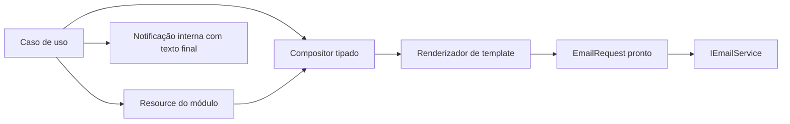

# ADR 0003: Padronizar resources, notificações internas e templates de e-mail

## Status

Aceito em 17/07/2026.

## Contexto

O backend do Atron possui mensagens observáveis definidas em resources e também literais espalhados por controllers, serviços, casos de uso e validadores. A composição de e-mails segue situação semelhante: o transporte compartilhado existe por meio de `IEmailService`, mas assuntos e corpos HTML ainda são construídos dentro dos fluxos de aplicação.

Essa distribuição dificulta manter a linguagem do produto, comparar o comportamento antes e depois de uma alteração e impedir que regras de composição conheçam detalhes de SMTP ou Brevo. A central de notificações internas também precisa de um contrato explícito sobre o texto persistido.

Esta decisão cobre a primeira implementação em pt-BR. Internacionalização por usuário ou requisição, fila de e-mail e retentativa automática permanecem fora do escopo.

## Decisão

### Fluxo de composição

### Resources

- a implementação inicial usará somente resources em pt-BR;
- não haverá seleção de cultura por usuário, `Accept-Language` ou configuração equivalente nesta rodada;
- cada módulo será proprietário das mensagens do próprio domínio;
- `Framework.Shared` manterá somente mensagens realmente transversais;
- configurações, provedores, hosts, chaves, constantes de protocolo e mensagens exclusivamente técnicas não serão tratados como texto localizável de produto;
- arquivos `.Designer.cs` continuarão gerados pela ferramenta e não serão editados manualmente;
- substituir um literal por resource não poderá alterar nível da mensagem, payload, status HTTP ou regra de negócio.

Convenção de chaves:

- usar o prefixo que representa o papel observável: `Erro_`, `Aviso_`, `Mensagem_` ou `Titulo_`;
- completar a chave com uma descrição semântica em PascalCase, como `Erro_TarefaNaoEncontrada`;
- não repetir o nome do módulo quando a própria classe resource delimitar o contexto;
- usar placeholders posicionais `{0}`, `{1}` e seguintes para valores dinâmicos;
- formatar placeholders explicitamente com a cultura pt-BR no chamador ou compositor;
- não concatenar fragmentos de resource para montar uma frase observável.

### Notificações internas

- a notificação interna persistirá título e mensagem finais em pt-BR;
- nome de resource, chave, parâmetros de formatação e cultura não serão persistidos;
- não será criada migration de localização nem alterado o esquema de `NotificacaoInterna`;
- alterações futuras de resources afetarão somente notificações novas;
- o texto histórico permanecerá imutável.

### Templates e transporte de e-mail

- corpos de e-mail serão arquivos HTML incorporados ao assembly proprietário;
- assuntos e textos observáveis serão obtidos de resources pt-BR;
- dados dinâmicos serão fornecidos por modelos tipados e codificados antes de entrar no HTML;
- URLs serão validadas antes de entrar em atributos de links;
- o compositor selecionará template, assunto e modelo;
- o renderizador carregará o template, validará campos obrigatórios e produzirá o HTML final;
- `IEmailService` receberá um `EmailRequest` pronto e continuará responsável somente pelo transporte;
- SMTP e Brevo permanecerão detalhes de `SharedEmailService`;
- templates específicos não serão movidos para `Framework.Shared` apenas para reutilizar a infraestrutura.

### Política de falha de entrega

As políticas abaixo orientam as fases que migrarem cada fluxo. A Fase 0 não altera o comportamento atual.

| Fluxo | Política | Consequência contratual |
|---|---|---|
| Recuperação de senha | Obrigatória | O fluxo informa falha quando o link não é entregue. |
| Reenvio de confirmação | Obrigatória | O fluxo informa falha e não afirma que a confirmação foi enviada. |
| Alteração de e-mail | Obrigatória | A solicitação não informa sucesso quando o link não é entregue. |
| Código de reativação | Obrigatória | O fluxo não informa que o código foi enviado quando o transporte falha. |
| Atribuição de tarefa | Consultiva | A tarefa permanece criada ou atribuída e o resultado recebe um aviso. |
| Confirmação concluída | Consultiva | A confirmação permanece concluída mesmo se o e-mail posterior falhar. |
| Primeiro acesso de usuário interno | Obrigatória | A criação somente conclui com o convite entregue e preserva a reversão atual em caso de falha. |
| Cadastro público com confirmação | Consultiva | A conta permanece criada e o resultado informa o problema, permitindo usar o reenvio sem induzir outro cadastro. |
| Diagnóstico de e-mail | Obrigatória | O endpoint falha se o envio testado falhar. |
| Notificação genérica compartilhada | Sem política operacional | Não possui consumidor além do registro de DI. |

Política obrigatória não implica rollback automático. Cada fase deve preservar a consistência do fluxo e definir explicitamente o estado persistido quando o transporte falhar.

### Exceções para a proteção arquitetural

O verificador poderá aceitar somente exceções identificadas explicitamente:

- arquivos `.resx` e templates `.html` incorporados;
- testes, dados de teste e asserções sobre mensagens;
- logs e exceções exclusivamente técnicas que não sejam devolvidas ao cliente;
- descrições históricas e de auditoria, enquanto preservarem o fato ocorrido e não forem usadas como resposta de produto;
- constantes de configuração ou protocolo;
- `SharedEmailService.cs`, somente para falhas técnicas do adaptador SMTP ou Brevo;
- código gerado, migrations, snapshots, `bin` e `obj`;
- `PlanejamentoCustoRelatorioHtmlMontador`, por produzir deliberadamente um relatório HTML que não é template de e-mail. Seus textos observáveis continuam sujeitos a resources.

Uma exceção não autoriza esconder texto observável em uma categoria técnica. Se o texto chegar ao `Resultado`, à resposta HTTP, à notificação interna ou ao e-mail de produto, deverá ser classificado e migrado.

## Alternativas consideradas

### Manter todas as mensagens no projeto compartilhado

Rejeitada porque faria `Framework.Shared` conhecer conceitos como Tarefa e Planejamento de Custo e reduziria a localidade das regras.

### Persistir chave e parâmetros das notificações internas

Rejeitada porque exigiria cultura de exibição, mudança de esquema e tratamento retroativo sem requisito atual de internacionalização.

### Construir HTML dentro dos casos de uso

Rejeitada porque mistura decisão de negócio, composição visual e transporte, além de dificultar a codificação segura de valores dinâmicos.

### Tratar toda falha de e-mail da mesma forma

Rejeitada porque alguns e-mails habilitam o próximo passo do usuário, enquanto outros são avisos complementares de uma operação já concluída.

## Consequências

- a migração ocorrerá por módulo e por fatia vertical, com comparação de payload antes e depois;
- o backend continuará entregando texto final em pt-BR ao Angular;
- não haverá migration de localização;
- templates precisarão de testes de carregamento, campos obrigatórios, codificação HTML e URLs;
- compositores precisarão de testes de assunto, template, destinatário e modelo;
- fluxos que hoje ignoram o `Resultado` do transporte serão ajustados apenas nas fases correspondentes;
- transforma a lista de exceções em allowlist explícita, evitando exclusões amplas por diretório.

## Validação

- conferir o inventário em `docs/inventario-resources-e-templates-email.md`;
- confirmar que a decisão não modifica código de aplicação nem regra de negócio por si só;
