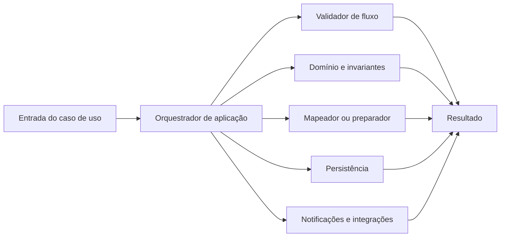

# ADR 0004: Orquestrar serviços de aplicação e segregar regras

## Status

Aceito.

## Contexto

O módulo de tarefas cresceu com regras de obtenção, solicitação, aprovação, notificação, resolução de usuários, mapeamento e validação distribuídas em `TarefaService`. Parte desse comportamento já foi extraída para colaboradores como `TarefaPreparacaoService` e `TarefaNotificacaoService`, mas serviços extensos ainda podem concentrar responsabilidades com razões de mudança independentes.

Repetir esse padrão em novos módulos dificulta localizar regras, amplia a superfície de teste e torna alterações de domínio mais arriscadas.

## Decisão

Serviços de aplicação serão orquestradores de casos de uso. Eles coordenam colaboradores, persistência e efeitos externos, mas não serão proprietários de regras de domínio, mapeamentos, criação de objetos ou blocos extensos de validação.

As responsabilidades serão distribuídas assim:

| Responsabilidade | Local preferencial |
|---|---|
| Regras, invariantes e transições | Entidades, objetos de valor, fábricas ou políticas de domínio. |
| Mapeamento e preparação | Mapeadores ou colaboradores especializados. |
| Validação extensa de entrada e fluxo | Validadores específicos de aplicação. |
| Transformações simples, puras e reutilizáveis | Auxiliares ou métodos de extensão coesos. |
| Notificações e integrações | Colaboradores especializados e contratos explícitos. |
| Ordem do caso de uso | Serviço orquestrador. |

Validadores de aplicação complementam as invariantes do domínio. Eles não podem permitir que uma entidade inválida exista quando for criada ou alterada por outro caminho.

Toda mudança em serviço deve avaliar, principalmente, responsabilidade única, segregação de interfaces e inversão de dependência. Uma extração só é aceita quando atribui a regra a um conceito claro e reduz acoplamento. Classes de passagem sem responsabilidade própria não atendem essa decisão.

## Alternativas consideradas

### Manter toda a lógica no serviço principal

Rejeitada porque aumenta o acoplamento e obriga testes de comportamentos independentes a compartilhar a mesma unidade extensa.

### Extrair cada bloco para uma nova classe

Rejeitada como regra automática. A quantidade de classes não mede qualidade; cada colaborador precisa possuir responsabilidade e contrato claros.

### Mover validações de fluxo para as entidades

Rejeitada quando a validação depende de repositórios, identidade autenticada ou integração externa. Nesses casos, a aplicação coordena e o domínio preserva apenas suas invariantes próprias.

## Consequências

- o fluxo principal dos serviços fica mais curto e explicita a ordem do caso de uso;
- regras passam a ter localidade e testes próprios;
- o número de colaboradores pode aumentar, exigindo nomes claros e interfaces pequenas;
- mudanças devem preservar contratos funcionais e comparar consumidores antes de remover compatibilidade;
- composição é preferida a herança quando não existir uma abstração de domínio comprovada.

## Validação

O padrão detalhado e o checklist de revisão estão em `docs/padrao-responsabilidades-servicos.md`. Refatorações de `TarefaService` devem usar esse documento como critério e preservar o contrato funcional do ADR 0002.
