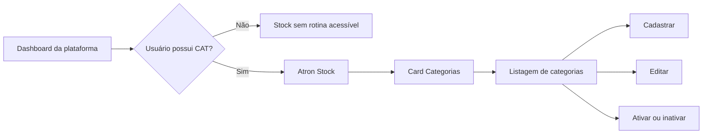

# ADR 0006: Entregar a rotina de Categoria no Atron Stock

## Status

Suspenso durante o encerramento da Fase 2. A Fase 9 do ADR 0007 foi
implementada e está em avaliação; este ADR somente será retomado depois da
aprovação explícita dessa fase.

O [ADR 0007](../transversais/0007-adotar-monolito-modular-com-host-neutro.md)
substitui a direção de publicar o Stock em um host público próprio. A
propriedade funcional da Categoria, o código `CAT`, as regras de acesso e as
fases da rotina permanecem válidos. O backend existente do Stock foi movido
para `AtronPlatform/Modules/Stock` e passou a ser publicado pelo host neutro
`AtronPlatform.WebApi`.

As validações funcionais pendentes da Fase 2 e as Fases 3 a 6 deste ADR somente
poderão ser retomadas depois que todas as Fases 1 a 9 do ADR 0007 estiverem
concluídas e aprovadas. A movimentação técnica do backend existente de Categoria
durante essa reestruturação não representa retomada funcional, não libera o
módulo no Angular e não autoriza novas rotinas do Stock.

## Contexto

O Atron Stock é responsável pela cadeia de suprimentos, estoque, patrimônio e
bens. Categoria é o primeiro cadastro do módulo a ser disponibilizado no front
Angular e servirá como referência para as próximas rotinas do Stock.

O backend já possui `CategoriaController`, serviço de aplicação, validação,
mapeamento, repositório, persistência e endpoints para:

- criar uma categoria;
- atualizar uma categoria;
- listar categorias;
- listar categorias inativas;
- consultar uma categoria por código;
- ativar ou inativar uma categoria.

O front ainda não possui rota, serviço, tela ou card para Categoria. O
dashboard já reconhece o agrupamento Atron Stock e reserva o código `CAT`, mas
mantém o módulo desabilitado. O catálogo de módulos do Tracker ainda não
registra `CAT`, portanto a rotina não pode ser relacionada aos perfis de acesso.

O host neutro compõe Tracker e Stock no mesmo processo, centralizando CORS,
autenticação e autorização. O Angular usa a mesma base pública para os módulos.
Essa disponibilidade técnica não libera o card nem substitui a proteção da
rota e dos endpoints pela política `CAT`.

## Decisão

Categoria será entregue como rotina própria do Atron Stock, identificada pelo
código canônico `CAT`.

### Propriedade do fluxo

- o Atron Stock permanece proprietário da entidade, das regras, da
  persistência, da aplicação e da API de Categoria;
- o AtronFront permanece proprietário da interação, do estado visual, das
  validações de formato e do consumo da API;
- o catálogo atual do Tracker continuará registrando o módulo e relacionando-o
  aos perfis de acesso;
- a futura centralização da configuração de módulos, perfis, estruturas
  funcionais e hierarquias permanece fora desta decisão.

### Acesso

- `CAT` será incluído no catálogo atual de módulos;
- perfis existentes não receberão `CAT` automaticamente;
- um administrador deverá relacionar explicitamente `CAT` aos perfis
  autorizados;
- a sessão do usuário deverá expor `CAT` após o relacionamento;
- a rota Angular será protegida pelo `ModuloGuard`;
- o WebApi do Stock também deverá autenticar o usuário e negar a operação
  quando o perfil não possuir `CAT`;
- Tracker e Stock deverão validar tokens com o mesmo contrato de assinatura,
  emissor e audiência.

### Navegação

O dashboard continuará apresentando os produtos da plataforma no primeiro
nível. Ao acessar Atron Stock, o usuário verá apenas as rotinas do Stock
permitidas para seus perfis.

O card Atron Stock somente será habilitado quando o usuário possuir pelo menos
uma rotina acessível desse módulo. O card Categorias será exibido somente para
quem possuir `CAT`.

### Manutenção de Categoria

- o código será obrigatório, terá no máximo 25 caracteres e ficará imutável
  após a criação;
- a descrição será obrigatória e terá no máximo 50 caracteres;
- uma categoria nova iniciará ativa;
- a listagem exibirá código, descrição e status;
- a remoção física não fará parte do fluxo;
- categorias deixarão de ser utilizadas por meio de ativação ou inativação,
  preservando identidade, auditoria e relacionamentos com produtos;
- regras e mensagens de negócio continuarão pertencendo ao backend;
- mensagens observáveis do backend continuarão usando resources conforme o
  [ADR 0003](../transversais/0003-padronizar-resources-notificacoes-e-templates-email.md).

### Integração entre front e API

- os environments do Angular manterão `stockApiRoute` como seam de
  configuração;
- durante o desenvolvimento transitório, `stockApiRoute` poderá apontar para o
  WebApi separado do Stock;
- no monólito modular publicado, `stockApiRoute` e `apiRoute` apontarão para o
  mesmo host neutro;
- `RotasApi` publicará o endpoint de Categoria a partir dessa configuração;
- o cliente Angular enviará o mesmo token de acesso usado na sessão;
- o Stock permitirá somente as origens configuradas para o front;
- os comandos da API deverão fornecer um contrato de resposta que permita ao
  front exibir as mensagens produzidas pelo backend sem recriar textos de
  negócio.

## Fases de implementação

Cada fase deve ser implementada, validada e aprovada antes do início da
seguinte.

**Gate arquitetural:** o encerramento funcional da Fase 2 e as Fases 3 a 6 estão
suspensos até a conclusão e aprovação das Fases 1 a 9 do ADR 0007. `CAT`, a
autorização e o backend existente serão preservados durante a migração do host,
mas card, navegação, listagem, cadastro e edição permanecem bloqueados.

### Fase 1: disponibilizar `CAT` nos perfis

**Status:** concluída em 26/07/2026.

**Objetivo:** permitir que Categoria seja relacionada a perfis de acesso.

**Escopo:**

- adicionar `CAT` ao catálogo de módulos;
- gerar a migration correspondente no Tracker;
- disponibilizar Categoria na manutenção de perfis;
- preservar os relacionamentos dos perfis existentes;
- confirmar a presença de `CAT` na sessão de um usuário autorizado.

**Critérios de conclusão:**

- a consulta de módulos retorna `CAT`;
- o perfil salva e recarrega o relacionamento;
- um usuário com o perfil recebe `CAT` na sessão;
- um usuário sem o relacionamento permanece sem `CAT`.

**Resultado da implementação:**

- `CAT`, com descrição `Categorias`, foi incluído no catálogo com o identificador
  12;
- a migration `20260727005918_IncluindoModuloCategoria` foi gerada para
  PostgreSQL e aplicada ao banco configurado;
- a manutenção de perfis já consulta o catálogo dinamicamente, portanto não
  exigiu alteração no Angular;
- testes focados comprovam a criação de perfil com `CAT`, a propagação do módulo
  para os dados complementares da sessão e a ausência de `CAT` para usuário sem
  relacionamento;
- os oito testes focados e os 86 testes da suíte completa do Tracker passaram;
- o WebApi do Tracker compilou sem erros;
- a listagem do EF confirmou a migration sem a marcação `Pending`;
- o relacionamento de `CAT` e sua disponibilidade na sessão foram validados
  manualmente com o perfil `Admins`.

### Fase 2: preparar integração e autorização do Stock

**Status:** implementada e validada localmente em 26/07/2026. O acesso com o
perfil `Admins` foi validado pelo usuário; o cenário autenticado sem `CAT`
permanece pendente.

**Objetivo:** estabelecer comunicação autenticada entre Angular e Stock antes
de expor a rotina.

**Escopo:**

- configurar a URL do WebApi do Stock no Angular;
- configurar CORS no Stock;
- ativar autenticação e autorização no pipeline;
- compartilhar o contrato de validação do JWT;
- proteger `CategoriaController` com `CAT`;
- alinhar o retorno dos comandos com as mensagens produzidas pela aplicação.

**Critérios de conclusão:**

- o Angular acessa a API do Stock sem falha de CORS;
- requisição sem autenticação recebe `401`;
- usuário autenticado sem `CAT` recebe `403`;
- usuário autenticado com `CAT` acessa os endpoints;
- mensagens de sucesso e erro chegam ao front sem textos de negócio
  duplicados.

**Resultado da implementação:**

- o Angular passou a publicar `stockApiRoute`, usando
  `https://localhost:44315/` no ambiente local, e `RotasApi` passou a expor o
  endpoint de Categoria;
- a URL de produção permanece vazia até Categoria ser composta no host neutro;
  conforme o ADR 0007, ela usará a mesma base pública do AtronPlatform;
- o pipeline do Stock passou a executar CORS, autenticação e autorização;
- Tracker e Stock mantêm configurações JWT próprias por host e foi confirmado,
  sem expor os valores, que os segredos, emissores e audiências locais são
  equivalentes;
- o provedor dinâmico, o requisito e o handler de autorização por módulo foram
  movidos do host do Tracker para a composição compartilhada em `Framework/IoC`;
- `CategoriaController` passou a exigir a política `Modulo:CAT` em todos os
  endpoints;
- os comandos de criação, atualização e alteração de status passaram a devolver
  as mensagens produzidas pela aplicação;
- dois testes de unidade comprovam que o handler autoriza uma sessão com `CAT`
  e não autoriza uma sessão sem `CAT`;
- uma chamada HTTP real sem token retornou `401`;
- o preflight do Angular retornou `204` com a origem
  `http://localhost:4200`, o método e o header de autorização permitidos;
- os 88 testes do Tracker passaram e os builds do Angular, Tracker e Stock
  concluíram sem erros;
- o usuário validou o acesso dos endpoints com o perfil `Admins`; a confirmação
  HTTP de `403` para uma sessão autenticada sem `CAT` permanece pendente.

**Atualização arquitetural da Fase 9 do ADR 0007:**

- os registros específicos do Stock passaram do `Framework/IoC` para
  `AddStockModule`, mantido por `AtronStock.Infrastructure`;
- `CategoriaController` e os demais controllers existentes do Stock passaram
  para `AtronPlatform/WebApi/Controllers/Stock`;
- o host e as configurações próprias de `AtronStock.WebApi` foram removidos;
- a rota técnica de Categoria usa a URL única da plataforma e continua
  protegida por `Modulo:CAT`;
- nenhuma tela, card, navegação ou regra funcional de Categoria foi criada
  durante a reorganização.

### Fase 3: entregar navegação e listagem

**Status:** suspensa pelo gate arquitetural do ADR 0007.

**Objetivo:** provar o fluxo de leitura de ponta a ponta.

**Escopo:**

- habilitar o agrupamento Atron Stock conforme os módulos acessíveis;
- criar a visão das rotinas do Stock;
- incluir o card Categorias;
- criar a rota protegida de Categoria;
- criar model, service e tela de listagem;
- exibir busca, ordenação, paginação e status.

**Critérios de conclusão:**

- o usuário com `CAT` visualiza e abre o card;
- o usuário sem `CAT` não visualiza o card nem acessa a rota diretamente;
- a listagem apresenta dados reais do Stock;
- categorias ativas e inativas são identificáveis.

### Fase 4: cadastrar Categoria

**Status:** suspensa pelo gate arquitetural do ADR 0007.

**Objetivo:** permitir o cadastro completo pelo Angular.

**Escopo:**

- criar o formulário;
- aplicar validações de formato e obrigatoriedade;
- consumir o endpoint de criação;
- apresentar as mensagens do backend;
- retornar à listagem após sucesso.

**Critérios de conclusão:**

- uma categoria válida é criada e aparece na listagem;
- código duplicado é rejeitado com a mensagem do backend;
- código, descrição e status respeitam o contrato da API.

### Fase 5: editar e alterar status

**Status:** suspensa pelo gate arquitetural do ADR 0007.

**Objetivo:** concluir a manutenção oferecida pela API.

**Escopo:**

- consultar uma categoria por código;
- bloquear a edição do código;
- atualizar descrição e status;
- oferecer ação confirmada de ativar ou inativar;
- atualizar a listagem após a operação.

**Critérios de conclusão:**

- a edição preserva o código;
- divergência entre código da rota e do corpo permanece bloqueada;
- ativação e inativação são refletidas na listagem;
- nenhuma operação remove fisicamente a categoria.

### Fase 6: estabilizar e documentar a entrega

**Status:** suspensa pelo gate arquitetural do ADR 0007.

**Objetivo:** encerrar a primeira rotina do Stock com evidência de regressão.

**Escopo:**

- executar builds do Angular, Tracker e Stock;
- executar testes focados de Categoria e autorização;
- validar manualmente perfis com e sem `CAT`;
- validar login, restauração de sessão e acesso após alteração de perfil;
- configurar e validar `stockApiRoute` com a mesma URL pública do host neutro
  antes do deploy;
- atualizar este ADR e o contexto do produto com o resultado efetivamente
  entregue.

**Critérios de conclusão:**

- builds e testes relacionados passam;
- os cenários autorizado, não autorizado e não autenticado foram verificados;
- o fluxo completo funciona em ambiente local;
- a configuração necessária para produção está documentada sem segredos;
- o status deste ADR representa o estado real da decisão.

## Alternativas consideradas

### Exibir Categoria sem registrá-la no catálogo

Rejeitada porque criaria uma rotina fora do modelo atual de perfis e impediria
controle consistente de acesso.

### Proteger somente o card e a rota Angular

Rejeitada porque o cliente não é uma fronteira de segurança e os endpoints do
Stock continuariam acessíveis diretamente.

### Colocar Categoria dentro do Tracker

Rejeitada porque Categoria pertence ao domínio do Stock e será consumida por
produtos e demais rotinas de estoque.

### Excluir categorias fisicamente

Rejeitada nesta fase porque a API já modela ativação e inativação e Categoria
pode manter relacionamentos históricos com produtos.

### Criar agora a configuração central da plataforma

Adiada. A centralização deve ser decidida junto com estruturas funcionais,
hierarquias e a evolução das permissões. Antecipá-la ampliaria o escopo da
primeira rotina do Stock.

## Consequências

- o catálogo atual do Tracker passa a conhecer uma rotina pertencente ao Stock
  até que a configuração central seja formalizada;
- o Angular usa a mesma base pública para Tracker e Stock;
- o Stock precisa participar do contrato de autenticação e autorização da
  plataforma;
- Categoria estabelece o padrão inicial de navegação e manutenção para as
  próximas rotinas do Stock;
- mudanças de perfil precisam invalidar ou atualizar a informação de acesso
  usada pelo usuário;
- a disponibilidade técnica do backend no host neutro não permite considerar a
  rotina pronta enquanto os critérios funcionais das Fases 2 a 6 não forem
  concluídos.

## Fora do escopo

- produtos, fornecedores, clientes, entradas, saídas e movimentações;
- permissões granulares por ação, como criar, editar ou visualizar;
- estrutura funcional e hierarquia de usuários;
- centralização definitiva do catálogo de módulos;
- exclusão física de Categoria;
- migração e deploy do host neutro, governados pelo ADR 0007.
