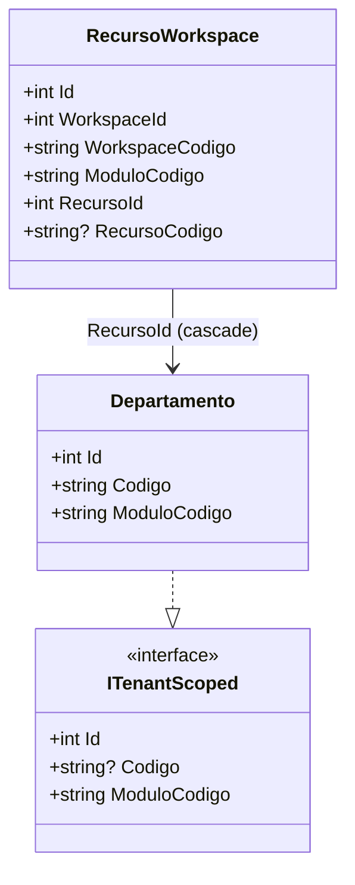

# ADR 0012: Isolar tenant via interceptor e Global Query Filter

## Contexto

A plataforma adota um modelo multi-tenant baseado em workspace. Até este ponto, o isolamento de entidades por tenant era implementado com tabelas de vínculo individuais (`DepartamentoWorkspace`, etc.), serviços de orquestração dedicados (`DepartamentoWorkspaceService`) e chamadas explícitas nos Use Cases.

Esse modelo apresenta dois gargalos estruturais identificados:

- **Crescimento linear de infraestrutura**: cada novo módulo ou entidade exige criar uma nova tabela de vínculo, novas interfaces de repositório (`CriarTenant`, `RemoverTenant`) e novos serviços de orquestração.
- **Acoplamento de infraestrutura nos Use Cases**: os Use Cases acumulam responsabilidade de persistência secundária de vínculos de tenant, misturando preocupações de negócio com infraestrutura.

A entidade `RecursoWorkspace` já existia no domínio sem estar em uso. O `WorkspaceResolver` já resolve o workspace ativo a partir dos claims do token.

## Decisão

O isolamento por tenant será centralizado em uma única tabela polimórfica (`RecursoWorkspace`) e implementado de forma transparente para Use Cases e repositórios, por meio de dois mecanismos do EF Core:

### A. Interface de escopo de tenant (`ITenantScoped`)

Entidades de domínio que requerem isolamento implementarão `ITenantScoped`, expondo `Id`, `Codigo` e `ModuloCodigo`. O `ModuloCodigo` deve retornar a constante canônica correspondente de `ModuloPolicies` (ex.: `"Modulo:DPT"` para Departamento).

A interface não introduz propriedades de workspace nas entidades, preservando o domínio livre de detalhes de infraestrutura.



### B. Persistência transparente via `TenantSaveChangesInterceptor`

Um `SaveChangesInterceptor` registrado no `AddDbContext` detecta entidades `ITenantScoped` adicionadas ao Change Tracker com estado `Added`. Para cada uma, resolve o workspace ativo via `IServiceScopeFactory` e insere o registro correspondente em `RecursoWorkspace` no mesmo ciclo de salvamento, sem segundo `SaveChanges`.

O interceptor nunca guarda `WorkspaceResolver` como campo. Resolve por chamada para evitar captive dependency (interceptor é singleton, `WorkspaceResolver` é scoped). O `RecursoWorkspace` nunca implementa `ITenantScoped` para evitar recursão.

### C. Leitura transparente via Global Query Filter

No `OnModelCreating` do `AtronDbContext`, todas as entidades que implementam `ITenantScoped` recebem um Global Query Filter construído por Reflection, equivalente a:

```csharp
entity.HasQueryFilter(e =>
    _context.RecursosWorkspace.Any(rw =>
        rw.RecursoId == e.Id &&
        rw.ModuloCodigo == e.ModuloCodigo &&
        rw.WorkspaceId == _workspaceIdAtual));
```

O `WorkspaceId` é resolvido em tempo de execução via `WorkspaceResolver` injetado no `DbContext`. Consultas administrativas que precisem de visão global utilizam `.IgnoreQueryFilters()`, segregadas em repositórios administrativos distintos.

### D. Remoção do vínculo via cascade delete

A FK de `RecursoWorkspace` para a entidade isolada é configurada com `OnDelete: Cascade`. Ao excluir um `Departamento`, o banco remove automaticamente o `RecursoWorkspace` correspondente.

### E. Tabela `DepartamentoTenant` descontinuada

A tabela `DepartamentoTenant` (entidade `DepartamentoWorkspace`) é removida junto com todos os seus artefatos de aplicação: `DepartamentoWorkspaceService`, os métodos `CriarTenant`/`RemoverTenant` de repositório e interface, e as sobrecargas de consulta filtradas por workspace via SQL raw.

## Alternativas consideradas

### Shadow Properties por entidade

Adicionar uma shadow property `WorkspaceId` diretamente em cada tabela de entidade. Evitaria a subconsulta `EXISTS` e simplificaria o filtro. Rejeitada porque exige `ALTER TABLE` em todas as tabelas isoladas e não oferece a visão unificada de pertencimento de recursos por módulo que `RecursoWorkspace` proporciona.

### Manter tabelas individuais de vínculo

Manter a abordagem atual e apenas automatizar a chamada. Rejeitada porque não resolve o crescimento linear: cada novo módulo ainda exigiria nova tabela, nova interface e novo serviço.

### Discriminador por módulo em tabela única sem polimorfismo

Uma tabela de vínculo com coluna de tipo, sem interface de domínio. Rejeitada porque perderia o contrato explícito que o compilador pode verificar — entidades precisariam ser listadas manualmente.

## Consequências

- Entidades de domínio isoladas por tenant implementam `ITenantScoped`; não carregam FK de workspace.
- Use Cases deixam de chamar serviços de vínculo de tenant explicitamente para criação; remoção é garantida pelo banco via cascade.
- Leituras filtradas por tenant passam a ser automáticas para qualquer consulta LINQ sobre entidades `ITenantScoped`.
- Novos módulos ganham isolamento apenas implementando a interface, sem infraestrutura adicional.
- Consultas fora do contexto HTTP (background jobs) devem garantir que o workspace seja resolvido por outro meio antes de persistir entidades `ITenantScoped`; o interceptor não insere `RecursoWorkspace` quando o workspace não puder ser resolvido, e o comportamento esperado deve ser documentado por caso de uso.
- Um índice composto em `(RecursoId, ModuloCodigo, WorkspaceId)` é obrigatório para manter a performance da subconsulta `EXISTS` nos filtros globais.

## Validação

- Build deve passar após a remoção de `DepartamentoWorkspace` e todos os seus artefatos.
- Criar um Departamento deve resultar em registro correspondente em `RecursoWorkspace` sem chamada explícita no Use Case.
- Consultar Departamentos com workspace diferente do token não deve retornar dados.
- Excluir um Departamento deve remover automaticamente o `RecursoWorkspace` vinculado.
- Testes do módulo devem passar; o fake de repositório não precisa mais implementar `CriarTenant`/`RemoverTenant`.
