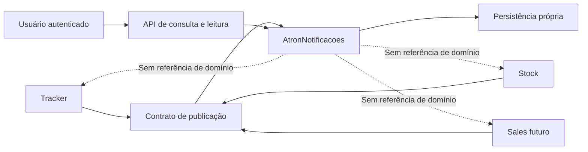

# ADR 0005: Extrair notificações internas como capacidade transversal

## Status

Substituído parcialmente pelo ADR 0008 em 27/07/2026.

A fronteira transversal, os contratos, a propriedade do conteúdo, o domínio,
o `NotificacoesDbContext`, as migrations e as regras de leitura ou exclusão
permanecem válidos. O host HTTP próprio, o cliente HTTP interno, o token de
serviço e o ciclo de publicação independente foram substituídos pela composição
in-process no `AtronPlatform.WebApi`.

| Fase | Situação | Observação principal |
|---|---|---|
| 0 a 4 | Concluídas | Contrato, módulo, persistência, autenticação e migração do Tracker implementados. |
| 5 | Gate operacional | Runtime legado removido; falta validar a publicação autenticada do Tracker no ambiente. |
| 6 | Concluída | Stock publica pelo contrato transversal. |
| 7 | Aguardando produto | Sales ainda não possui escopo e implementação próprios. |
| 8 | Concluída | Operação, métricas, autorização e contratos cobertos. |

**Atualização de estrutura em 21/07/2026:** os assemblies reutilizáveis foram
consolidados em `Framework/AtronNotificacoes/AtronNotificacoes.Core.csproj`.
Domain, Application, Contracts, Client, Infrastructure, DbContext e migrations
continuam com propriedade exclusiva de AtronNotificacoes, agora organizados
como pastas internas do Core. As referências abaixo ao antigo projeto
`AtronNotificacoes.Infrastructure` descrevem a fronteira lógica e o estado
físico anterior à consolidação.

## Contexto

As notificações internas nasceram no Atron Tracker para acompanhar eventos de tarefas. A controller, o serviço, o repositório, a entidade e a configuração de persistência atuais dependem de Usuario, Tarefa, IUsuarioRepository e AtronDbContext do Tracker.

O Atron precisa que a mesma capacidade atenda Tracker, Stock e Sales. Mover somente NotificacaoInternaController para outro projeto não atende esse objetivo: o novo host continuaria dependente do domínio e da persistência do Tracker, sem oferecer reuso real.

O ADR 0002 já define a central de notificações como uma capacidade própria do produto. O ADR 0003 define que cada notificação persiste título e mensagem finais em pt-BR e que o histórico não deve ser reinterpretado por resources futuros. Esta decisão torna a fronteira técnica compatível com essas regras.

## Decisão

Será criado o módulo vertical AtronNotificacoes, com host HTTP próprio e responsabilidade por publicar, consultar e marcar notificações internas como lidas.

O módulo será dono de seu contrato, aplicação, persistência, migrations e API. As migrations ficam na pasta `Migrations/` do projeto `AtronNotificacoes.Infrastructure`, sem um projeto separado apenas para migrations. Ele não referenciará entidades, repositórios ou DbContext de Tracker, Stock ou Sales.

O contrato de publicação deverá conter, no mínimo:

- identificador transversal do destinatário;
- módulo de origem e tipo de evento;
- título e mensagem finais em pt-BR;
- URL de destino;
- referência externa opcional, tratada como valor opaco;
- data de criação e identificador de correlação quando necessário para suporte.

O contrato não aceitará entidades como Tarefa, Pedido, Produto ou Usuario. Também não criará chaves estrangeiras para tabelas de módulos produtores. A central manterá apenas o histórico e o estado de leitura.

As notificações usarão chave primária numérica longa gerada por sequence do banco. A sequence poderá ter valor inicial aleatório na criação do ambiente, mas cada novo identificador seguirá a sequência. Não serão usados GUIDs ou números aleatórios por registro como chave primária.

Cada módulo produtor continuará dono de sua regra de negócio, da decisão de publicar e da composição de textos observáveis. O módulo de notificações será dono apenas do canal interno, da consulta e do estado de leitura.

O destinatário pode excluir uma notificação específica da própria lista. A exclusão é lógica e registrada pela central: ela oculta o item apenas da consulta do destinatário, preservando conteúdo e rastreabilidade operacional. A central autoriza a operação exclusivamente pelo `CodigoUsuario` do JWT e nunca expõe exclusão de outro destinatário.

Tracker será o primeiro consumidor migrado. Stock e Sales adotarão o mesmo contrato quando seus eventos de produto forem definidos. A migração deve preservar o comportamento do front e os textos históricos já persistidos.

### Visão arquitetural

Cada seta de publicação transporta apenas dados do contrato. Nenhuma entidade de domínio atravessa a fronteira do módulo produtor.

## Fases de implementação

### Fase 0: Contrato e fronteiras

Definir os DTOs de publicação e consulta, o identificador transversal de destinatário, a autenticação entre módulos e a política de falha por evento. Confirmar que publicação consultiva não bloqueia a transação do produtor.

Decisões da fase:

- o destinatário inicial é o CodigoUsuario emitido no claim compartilhado CODIGO_USUARIO, nunca uma chave estrangeira para Usuario;
- a consulta usa o JWT do usuário; a publicação usará token de serviço com audiência específica na Fase 3;
- o produtor envia título e mensagem finais em pt-BR, enquanto a referência externa permanece opaca;
- o identificador da notificação é long gerado por sequence; a aleatoriedade, se desejada, existe somente no valor inicial da sequence;
- até uma política específica ser aprovada, a publicação é consultiva e não participa de transação distribuída;
- o contrato está no assembly AtronNotificacoes.Contracts e sua especificação de payload está em docs/contratos-notificacoes-internas-v1.md.

Critério de saída: contrato revisado, sem tipos de domínio de Tracker, Stock ou Sales, e testes de serialização do payload.

### Fase 1: Estrutura do módulo

Criar AtronNotificacoes na solução com host, composição de dependências, documentação de API e testes próprios. Nenhum módulo consumidor será alterado nesta fase.

Implementação da fase:

- host AtronNotificacoes criado com referência exclusiva ao assembly de contratos;
- autenticação JWT própria, sem registrar infraestrutura, DbContext ou serviços de Tracker;
- Swagger e ReDoc configurados;
- endpoint protegido GET api/notificacoes/prontidao criado para confirmar a prontidão do host antes dos endpoints de negócio da Fase 2;
- teste próprio confirma a proteção e a rota documentada.

Critério de saída: host inicia, endpoints protegidos estão documentados e a solução compila.

### Fase 2: Domínio e persistência próprios

Criar a entidade de notificação transversal, repositório, contexto e migrations próprios. Registrar destinatário, origem, evento, conteúdo final, destino, leitura e referência externa sem chaves estrangeiras entre módulos.

Implementação da fase:

- assemblies separados para domínio, aplicação e infraestrutura; `AtronNotificacoes.Infrastructure` também contém a pasta `Migrations/`;
- migration inicial cria a tabela `NotificacoesInternas`, o índice por destinatário, leitura e data de criação, e a sequence `notificacoes_internas_ids` iniciada em `1000001`;
- a persistência não possui chaves estrangeiras para Tracker, Stock, Sales ou Usuário;
- a aplicação cria, consulta por destinatário, marca uma, marca todas como lidas e exclui logicamente uma pelo destinatário;
- testes de integração do módulo cobrem os cinco fluxos e o isolamento por destinatário.

Critério de saída: criar, listar por destinatário, marcar uma, marcar todas como lidas e excluir uma notificação em testes de integração do módulo.

### Fase 3: Publicação autenticada

Implementar o adaptador de publicação usado pelos módulos e a autenticação de serviço para o host de notificações. Incluir rastreabilidade por correlação, tratamento de indisponibilidade e testes de contrato.

Implementação da fase:

- endpoint `POST api/notificacoes/publicacoes` protegido pela policy `PublicadorDeNotificacoes`;
- tokens de serviço usam emissor, audiência e chave distintos dos tokens de usuário, com os claims `tipo_token=servico` e `escopo=notificacoes.publicar`;
- consultas, alterações de leitura e exclusão lógica exigem a policy `UsuarioDeNotificacoes`, que requer `CodigoUsuario` e rejeita tokens de serviço;
- `AtronNotificacoes.Client` fornece o adaptador HTTP reutilizável e emite tokens de curta duração para a audiência da central;
- `ChaveIdempotencia` é persistida e possui índice único por módulo de origem quando informada; uma repetição devolve a notificação já criada;
- `CorrelacaoId` é persistido e propagado no cabeçalho `X-Correlation-Id`;
- falhas de conectividade ou resposta HTTP não bem-sucedida retornam resultado consultivo ao produtor, sem introduzir transação distribuída.

Critério de saída: um produtor de teste publica uma notificação sem referenciar o domínio do módulo de notificações.

### Fase 4: Migração do Tracker

Substituir o fluxo de criação de notificações de tarefas pelo adaptador transversal. Migrar os endpoints de leitura e marcação preservando o contrato consumido pelo Angular ou publicando uma rota de compatibilidade temporária. Planejar e executar a migração do histórico existente de forma idempotente.

Implementação da fase:

- `TarefaNotificacaoInternaService` publica pelo contrato transversal, com módulo de origem `Tracker`, referência opaca da tarefa, chave de idempotência e correlação;
- a falha de publicação permanece consultiva e não interrompe a criação, obtenção ou aprovação de tarefas;
- `NotificacaoInternaController` do Tracker foi usado temporariamente como fachada de compatibilidade, encaminhando consulta e marcação ao host de notificações com o JWT do usuário;
- o DTO de compatibilidade usou `long` para acomodar o identificador da central sem alterar o contrato JSON do front durante a janela de transição;
- o Tracker só registra os clientes quando `NotificacoesInternas:BaseUrl` e as credenciais de serviço forem configuradas; sem configuração, a publicação não interrompe tarefas e a consulta retorna falha controlada;
- o projeto `Tools/NotificacoesLegacyMigrator` transfere o histórico com chave `tracker:legado:notificacao:{id-legado}`, preserva leitura e suporta simulação;
- o runbook de implantação está em `docs/migracao-notificacoes-tracker.md`.

Critério de saída: os cenários atuais de tarefas continuam gerando, exibindo e marcando notificações sem dependência de NotificacaoInterna no domínio do Tracker.

### Fase 5: Transição do front e retirada do legado

Configurar o Angular para consumir a API da central diretamente, validar sessão, atualização de lista, deep links e estados de leitura. A fachada `NotificacaoInternaController` do Tracker permanece somente durante a janela de compatibilidade. Depois da reconciliação do histórico, remover controller, DTO de compatibilidade, serviço, repositório, entidade, configuração EF, DbSet e registrations legadas do Tracker como uma única fatia. Em 20/07/2026, o runtime legado foi removido; a validação autenticada de publicação pelo Tracker ainda é o gate operacional restante.

Decisões da fase:

- o Angular recebe uma URL explícita da central por ambiente e passa a usar `api/notificacoes`, sem encaminhamento pelo host do Tracker;
- a autenticação de consulta continua usando o JWT do usuário, agora enviado diretamente à central;
- o formato consumido pelo Angular é ajustado uma única vez no seu serviço de notificações; não será mantido um DTO de compatibilidade no Tracker depois da transição;
- o migrador deve ser executado primeiro em simulação, depois de forma efetiva e novamente em simulação até que o total migrável seja zero;
- a remoção da tabela e das migrations legadas depende da janela de reversão e da confirmação operacional descritas no runbook;
- a publicação permanece consultiva: indisponibilidade da central não reverte o caso de uso produtor.

Critério de entrada: URL da central configurada por ambiente, CORS validado, testes de contrato da rota de consulta aprovados e plano de reversão definido.

Critério de saída: front consulta e marca leitura diretamente na central; o histórico foi reconciliado; não restam referências de runtime ao fluxo legado no Tracker; os testes de regressão do Tracker, da central e do front passam.

### Fase 6: Adoção pelo Stock

Escolher um evento de produto do Stock, compor seu conteúdo no próprio módulo e publicar pelo contrato transversal. Não reproduzir regras de Tracker.

Implementação da fase:

- o evento escolhido é `SaidaEstoqueRegistrada`, emitido para cada item de uma venda concluída após a atualização do saldo;
- Stock compõe título e mensagem em seu resource próprio, incluindo código, descrição, quantidade retirada e saldo resultante;
- o destinatário é configurado por `NotificacoesEstoque:ResponsavelCodigo`, pois o domínio atual de Stock ainda não modela responsável por produto, depósito ou operação;
- a publicação usa módulo de origem `Stock`, referência opaca `produto:{id}`, chave por venda e item, e correlação por venda e produto;
- a ausência de responsável ou a indisponibilidade da central não reverte a venda;
- Stock usa o mesmo contrato e cliente registrados pela infraestrutura compartilhada, sem referência ao domínio de Tracker.

Critério de saída: Tracker e Stock usam o mesmo contrato sem dependência entre seus domínios.

### Fase 7: Adoção pelo Sales

Repetir a adoção para um evento de Sales quando o módulo tiver escopo formalizado. Avaliar se o contrato cobre o novo evento sem extensão específica para Sales.

Critério de saída: Sales publica e consulta notificações pelo módulo transversal; qualquer evolução de contrato é compatível com Tracker e Stock.

#### Verificação de pré-condição em 19/07/2026

O repositório não possui um projeto `AtronSales`, e `CONTEXT.md` classifica o Sales como módulo planejado, sem evento comercial, caso de uso, identidade de destinatário ou rota de navegação formalizados. O contrato v1 já comporta um produtor `Sales` por meio de `ModuloOrigem`, `TipoEvento`, `DestinatarioCodigo`, conteúdo final, referência opaca, idempotência e correlação, portanto não requer extensão antecipada.

Nenhum produtor artificial foi criado. A fase será retomada quando o módulo definir, no mínimo, um evento de negócio persistido, seu destinatário responsável e o destino de navegação correspondente.

### Fase 8: Operação e evolução

Adicionar observabilidade, métricas de publicação e falha, retenção de histórico, testes de autorização, testes de contrato entre produtores e política explícita para atualização em tempo real. Health checks operacionais, se necessários, devem ser protegidos e não reutilizar o antigo endpoint público de teste de banco.

Critério de saída: indicadores operacionais definidos e cobertura de regressão para os três produtores.

#### Implementação em 19/07/2026

- o host expõe os contadores `atron_notificacoes_publicacoes_total` e `atron_notificacoes_falhas_publicacao_total` pelo medidor `Atron.Notificacoes`, com tags sem dados pessoais;
- `GET /api/notificacoes/saude` verifica a conectividade com o banco e exige a política de publicador de serviço;
- as políticas de usuário e de publicador possuem testes de autorização com os claims efetivamente exigidos;
- os testes de contrato verificam que o payload v1 atende Tracker, Stock e o futuro produtor Sales sem extensão;
- a política de retenção sem expurgo automático e a decisão de não adotar atualização em tempo real nesta versão estão em `docs/operacao-notificacoes-internas.md`.

O critério de cobertura para o Sales está atendido no contrato, mas a adoção de negócio segue pendente na Fase 7 porque o módulo ainda não possui implementação própria.

## Alternativas consideradas

### Manter notificações no Tracker

Rejeitada porque Stock e Sales precisariam criar capacidades paralelas ou depender diretamente do Tracker.

### Mover somente a controller para outro projeto

Rejeitada porque serviço, entidade, repositório e DbContext continuariam acoplados ao Tracker.

### Criar uma biblioteca compartilhada sem host próprio

Rejeitada porque não definiria um dono operacional para a consulta, leitura, retenção e autorização centralizadas.

## Consequências

- A extração é um programa de migração em fases, não uma movimentação de arquivos.
- O primeiro corte exige decidir a identidade transversal e a autenticação entre módulos.
- A persistência atual vinculada a Usuario e Tarefa precisará ser migrada com cuidado.
- O módulo reduz duplicação futura, mas introduz custo de implantação, monitoramento e compatibilidade de contratos.
- Resources de cada módulo continuam donos do texto de seus eventos; a central persiste o texto final conforme ADR 0003.
- Produtores usam composição por meio de `INotificacoesInternasPublisher`; não há classe base de notificação para serviços de domínio. Cada módulo preserva a responsabilidade por evento, destinatário, texto e referência opaca.
- A convenção de testes fica em `docs/arquitetura-testes.md`: projetos com nome curto por módulo e funcionalidades organizadas em pastas internas.

## Validação por fase

Cada fase deve encerrar com revisão de escopo, git diff --check, build dos projetos afetados em saída isolada e testes focados. As fases de migração do Tracker, Stock e Sales também exigem teste de contrato e teste de integração da publicação autenticada.
