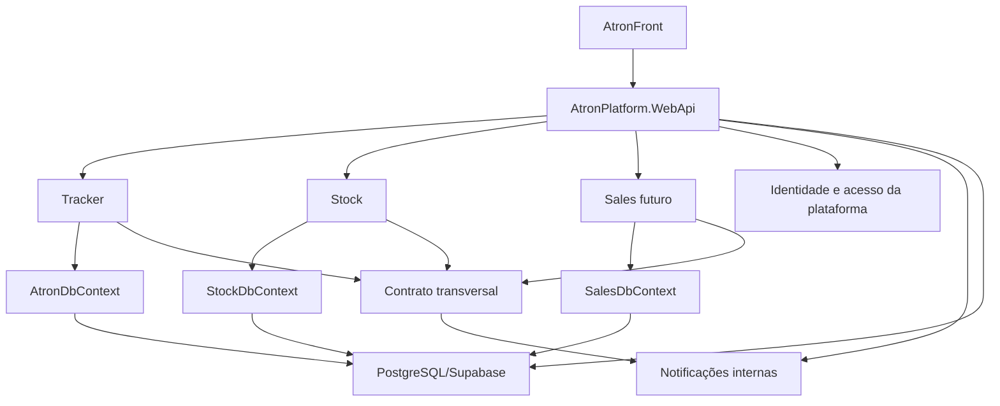

# ADR 0007: Adotar monólito modular com host neutro

## Status

Aceito em 26/07/2026. A decisão arquitetural foi executada de forma incremental.
As Fases 0 a 9 foram concluídas e aprovadas em 27/07/2026. O ADR 0008 ampliou o
host único para incorporar também Notificações Internas.

## Contexto

O Atron evoluiu de uma aplicação concentrada no Tracker para uma plataforma com
módulos de produto e capacidades transversais:

- Atron Tracker para gestão interna e estrutura organizacional;
- Atron Stock para suprimentos, estoque, patrimônio e bens;
- Atron Sales como módulo comercial e financeiro planejado;
- AtronNotificacoes, naquele momento, como capacidade transversal com contrato e host próprios;
- AtronAuditoria como host transversal atual ainda acoplado à composição global;
- AtronFront como interface única da plataforma.

Tracker e Stock já possuem projetos de domínio, aplicação, infraestrutura e
WebApi separados. Entretanto, a separação dos executáveis não representa
autonomia arquitetural:

- o projeto global `Framework/IoC` referencia Application e Infrastructure de
  Tracker e Stock;
- os hosts consomem esse mesmo ponto global de composição;
- o Stock registra serviços e persistência do Tracker para reutilizar
  autenticação, perfis e autorização;
- `Framework/Shared` ainda possui referência ao domínio do Tracker;
- os módulos usam o mesmo contrato JWT e o mesmo banco PostgreSQL;
- o Dockerfile publicado no Render inicia somente o WebApi do Tracker;
- publicar um Web Service por módulo aumentaria deploys, variáveis, cold starts,
  custo operacional e consumo do plano de hospedagem sem oferecer independência
  real entre os módulos.

Adicionar Sales repetindo a estrutura atual ampliaria as referências cruzadas e
criaria vários processos que precisariam ser construídos e publicados em
conjunto. Isso reuniria o custo operacional de um sistema distribuído sem obter
o isolamento de um microsserviço.

O Atron também é usado para desenvolver repertório de arquitetura. Esse
objetivo permanece, mas o produto principal não deve pagar continuamente a
complexidade de rede, observabilidade distribuída, consistência eventual e
operação em múltiplos provedores apenas para exercitar uma topologia.

## Decisão

O Atron principal adotará um **monólito modular**. Tracker, Stock e o futuro
Sales serão módulos pares, executados no mesmo processo HTTP e publicados pelo
mesmo host neutro da plataforma.

O monólito é uma decisão de execução e publicação, não de mistura de domínio.
Cada módulo continuará responsável por suas regras, casos de uso, persistência,
migrations, resources e testes.

A topologia completa da plataforma poderá possuir capacidades distribuídas sem
transformar o núcleo de produto em um “monólito distribuído”. Após o ADR 0008,
nenhuma capacidade possui execução externa aprovada. Uma extração futura exigirá
contrato, estado e necessidade operacional próprios aprovados em ADR.

### Host neutro

Será criado o host executável:

```text
AtronPlatform/WebApi/AtronPlatform.WebApi.csproj
```

O host ficará fora de `Framework`, porque é a borda executável da plataforma e
não uma biblioteca reutilizável.

O host será responsável somente por:

- iniciar o processo HTTP;
- compor os módulos;
- configurar autenticação e autorização;
- configurar CORS, Swagger, ReDoc e middlewares;
- publicar controllers e rotas;
- carregar configurações do ambiente;
- expor health checks da aplicação;
- produzir a unidade publicada pelo Docker.

O host não será responsável por:

- regras de negócio;
- entidades de domínio;
- acesso direto a tabelas;
- decisões de fluxo pertencentes a Tracker, Stock ou Sales;
- compartilhamento de entidades entre módulos.

`AtronTracker/WebApi` e `AtronStock/WebApi` foram definidos como hosts
transitórios. Depois da validação das rotas equivalentes, foram removidos nas
Fases 8 e 9.

### Módulos pares

Tracker, Stock e Sales não serão aninhados uns dentro dos outros. Os módulos
ficarão agrupados fisicamente sob `AtronPlatform/Modules`, mantendo projetos
próprios e fronteiras pares:

```text
AtronPlatform/
  WebApi/
    Controllers/
      Tracker/
      Stock/
      Sales/
    AtronPlatform.WebApi.csproj
  Modules/
    Tracker/
      Application/
        AtronTracker.Application.csproj
      Domain/
        AtronTracker.Domain.csproj
      Infrastructure/
        AtronTracker.Infrastructure.csproj
    Stock/
      Application/
        AtronStock.Application.csproj
      Domain/
        AtronStock.Domain.csproj
      Infrastructure/
        AtronStock.Infrastructure.csproj
    Sales/
      Application/
        AtronSales.Application.csproj
      Domain/
        AtronSales.Domain.csproj
      Infrastructure/
        AtronSales.Infrastructure.csproj

Framework/
  Shared/
  AtronNotificacoes/

Tests/
  Tracker.Tests/
  Stock.Tests/
  Sales.Tests/
  Shared.Tests/
  Notificacoes.Tests/
```

A reorganização será incremental para manter os diffs verificáveis. Tracker será
movido e padronizado primeiro. Stock não será movido, composto ou testado na
mesma fase do Tracker. Sales somente receberá estrutura física quando seu
primeiro escopo for formalizado.

O host legado do Tracker permanecerá temporariamente em
`AtronTracker/WebApi/AtronTracker.WebApi.csproj` para rollback. Ele não faz
parte da estrutura definitiva e será removido depois que o Tracker estiver
publicado e validado no host neutro.

### Apresentação e controllers

Inicialmente, os controllers HTTP finos ficarão no host neutro, organizados por
módulo:

```text
Controllers/Tracker/TarefaController.cs
Controllers/Stock/CategoriaController.cs
Controllers/Sales/VendaController.cs
```

Os controllers devem:

- traduzir HTTP para contratos de aplicação;
- delegar o fluxo ao módulo proprietário;
- aplicar atributos de rota, autenticação e autorização;
- devolver dados e mensagens produzidos pela aplicação.

Os controllers não devem possuir regras de negócio, consultar DbContexts ou
coordenar diretamente repositórios.

Projetos `Presentation` separados e carregamento por `ApplicationPart` ficam
adiados. Essa separação somente será introduzida quando houver um consumidor,
uma necessidade de extração ou um ciclo de publicação que justifique o novo
assembly.

### Composição de dependências

Cada módulo será dono de sua composição:

```csharp
services.AddTrackerModule(configuration);
services.AddStockModule(configuration);
services.AddSalesModule(configuration);
```

Essas extensões serão mantidas no módulo proprietário, próximas à sua
Infrastructure. O host neutro chamará as extensões e não conhecerá os detalhes
internos de registro.

O `Framework/IoC` global foi reduzido gradualmente e eliminado na Fase 9. No
estado definitivo:

- Tracker não referenciará Application ou Infrastructure do Stock;
- Stock não referenciará Application ou Infrastructure do Tracker;
- Sales não referenciará implementações internas dos outros módulos;
- `Framework/Shared` não referenciará Domain, Application ou Infrastructure de
  nenhum módulo;
- somente o host poderá referenciar todos os módulos para compor o processo.

Capacidades compartilhadas devem ser pequenas, estáveis e independentes dos
domínios consumidores. Uma classe não será movida para `Shared` apenas por ser
usada em dois lugares.

### Fronteiras entre módulos

Um módulo não poderá:

- consultar o DbContext de outro módulo;
- usar diretamente repositórios internos de outro módulo;
- referenciar entidades de domínio de outro módulo;
- alterar tabelas que pertencem a outro módulo;
- depender de um controller ou host de outro módulo.

Uma integração entre módulos deverá usar uma destas formas:

- contrato de aplicação explicitamente publicado;
- evento interno imutável;
- contrato transversal estável;
- API ou evento externo, quando a capacidade estiver fora do processo.

Enquanto os módulos estiverem no mesmo processo, a chamada poderá ser
in-process. O contrato deve continuar explícito para que uma extração futura não
exija reescrever as regras de negócio.

### Dados e migrations

O monólito modular usará inicialmente a mesma instância PostgreSQL/Supabase.
Cada módulo manterá seu próprio DbContext, configurações de entidades, snapshot
e migrations:

```text
AtronDbContext   -> Tracker
StockDbContext   -> Stock
SalesDbContext   -> Sales
```

A propriedade lógica dos dados é obrigatória mesmo enquanto as tabelas
permanecerem no schema atual. Nenhum módulo acessará tabelas de outro módulo por
conveniência.

Schemas físicos como `tracker`, `stock`, `sales` e `identity` são uma direção
de evolução, mas não serão criados durante a consolidação inicial do host. A
movimentação de tabelas exigirá planejamento de migration, compatibilidade,
rollback e decisão específica para não misturar mudança de execução com mudança
de dados.

### Identidade, perfis e configuração central

Usuários, autenticação, perfis de acesso, catálogo de módulos, estrutura
funcional e hierarquias são capacidades da plataforma. Hoje parte dessa
responsabilidade está fisicamente no Tracker.

Durante a adoção do monólito modular, esse código poderá permanecer no Tracker
por compatibilidade, mas não será considerado propriedade definitiva do módulo.
A centralização será realizada em fase própria, dentro do mesmo processo, antes
de se considerar qualquer extração como serviço independente.

O contrato JWT será configurado uma única vez pelo host neutro. Segredos,
connection strings e credenciais continuarão fora dos arquivos versionados,
usando variáveis de ambiente no Render e User Secrets no desenvolvimento.

### API e Angular

As rotas públicas atuais serão preservadas inicialmente para evitar uma quebra
ampla no AtronFront:

```text
/api/Tarefa
/api/Categoria
/api/Venda
```

Prefixos como `/api/tracker`, `/api/stock` e `/api/sales` não serão introduzidos
durante a consolidação. Uma mudança de contrato de rota exigirá decisão e
transição próprias.

`apiRoute` e `stockApiRoute` poderão apontar para a mesma URL pública:

```ts
apiRoute: 'https://atronplatform.onrender.com/',
stockApiRoute: 'https://atronplatform.onrender.com/',
```

`stockApiRoute` será mantida como seam de configuração. Se Stock precisar ser
extraído no futuro, o front poderá trocar o destino sem reescrever todos os
services.

### Publicação

O Dockerfile principal publicará somente
`AtronPlatform/WebApi/AtronPlatform.WebApi.csproj`.

Tracker, Stock e Sales compartilharão:

- um Web Service no Render;
- uma URL pública;
- um processo;
- uma configuração principal de autenticação;
- um ciclo de deploy.

Uma alteração em qualquer módulo poderá publicar o monólito completo. Essa
consequência é aceita para reduzir custo e coordenação no estágio atual do
produto.

### Notificações Internas

O ADR 0008 substituiu a exceção distribuída prevista originalmente. A capacidade
mantém contrato, aplicação, persistência, migrations e testes próprios, mas é
composta in-process pelo host neutro. Falhas consultivas continuam sem desfazer
transações dos produtores porque o publicador usa escopo próprio com transação
ambiente suprimida.

### Auditoria e demais capacidades horizontais

O host `AtronAuditoria` não foi considerado um serviço independente aprovado.
Ele não possuía a autonomia exigida para permanecer como processo separado e
foi removido na Fase 8.

Por padrão, o endpoint de auditoria será composto no host neutro. Sua lógica,
contratos e persistência deverão formar uma capacidade transversal coesa, sem
depender de controllers, entidades ou DbContexts dos módulos auditados.

Uma futura extração de Auditoria para processo independente exigirá ADR próprio,
contrato estável, propriedade de dados e necessidade operacional comprovada.

Transporte de e-mail, cache e outros adaptadores compartilhados também não serão
tratados como serviços apenas por atenderem vários módulos. Eles permanecem
capacidades in-process enquanto não houver justificativa de operação
independente.

### Estudos de microsserviços

Microsserviços continuarão como linha de estudo, preferencialmente em
laboratórios locais com Docker Compose ou protótipos descartáveis.

O produto principal somente extrairá um módulo quando houver necessidade
comprovada de pelo menos um destes pontos:

- escala independente;
- isolamento de falhas;
- ciclo de publicação independente;
- equipe proprietária independente;
- requisito de disponibilidade diferente;
- fronteira e contrato estáveis;
- benefício operacional maior que o custo distribuído.

Executar vários processos interdependentes não será tratado, isoladamente, como
adoção de microsserviços.

## Visão arquitetural



As setas do host para os módulos representam composição. Elas não autorizam
dependências diretas entre os domínios.

## Regras arquiteturais verificáveis

A implementação deverá introduzir testes ou verificações equivalentes para
proteger pelo menos estas regras:

- Domain de um módulo não referencia outro módulo;
- Application de um módulo não referencia Infrastructure;
- `Framework/Shared` não referencia módulos de produto;
- módulos não referenciam os WebApis transitórios;
- apenas o host neutro compõe todos os módulos;
- controllers não usam DbContext diretamente;
- cada migration pertence ao DbContext do módulo proprietário;
- mensagens observáveis continuam usando resources;
- segredos não são versionados.

## Fases de implementação

Cada fase deverá ser implementada, validada e aprovada antes da seguinte.

| Fase | Situação inicial | Resultado esperado |
|---|---|---|
| 0 | Concluída | Decisão registrada no ADR, índice e contexto. |
| 1 | Concluída | Host neutro criado sem alterar rotas públicas. |
| 2 | Concluída | Estrutura física e projetos do Tracker padronizados. |
| 3 | Concluída | Composição de dependências do Tracker isolada. |
| 4 | Concluída | Tracker executado pelo host neutro com paridade. |
| 5 | Concluída | Composição global segregada e dependências protegidas. |
| 6 | Concluída | Capacidades transversais consolidadas na plataforma. |
| 7 | Concluída | Corte local aprovado; publicação e validação no Render permanecem delegadas ao usuário. |
| 8 | Concluída | Hosts transitórios do Tracker e Auditoria removidos. |
| 9 | Em avaliação | Estrutura física e composição técnica do Stock migradas, sem evolução funcional de Categoria. |

### Gate para retomar Stock e Categoria

O encerramento funcional da Fase 2 e as Fases 3 a 6 do ADR 0006 permanecerão
suspensos até a conclusão e aprovação de todas as Fases 1 a 9 deste ADR.

Stock permanecerá intacto durante as fases exclusivas do Tracker. Somente na
Fase 9 seu código poderá ser movido e composto tecnicamente para preservar
contratos e comprovar a fronteira modular. Isso inclui o backend já existente,
mas não autoriza:

- habilitar o card Atron Stock;
- criar navegação, listagem ou formulários de Categoria;
- ampliar casos de uso de Categoria;
- iniciar novas rotinas funcionais do Stock;
- considerar a disponibilidade técnica do endpoint como entrega do produto.

O gate será liberado somente quando:

- o host neutro for o único executável de Tracker, Stock e Auditoria;
- a composição de cada módulo estiver segregada e protegida por testes
  arquiteturais;
- referências cruzadas indevidas entre Tracker, Stock e `Shared` tiverem sido
  removidas;
- propriedade de DbContexts, migrations, identidade e capacidades transversais
  estiver documentada;
- Dockerfile, configuração documentada do Render e Angular utilizarem a
  topologia definitiva; a publicação real continua delegada ao usuário;
- os hosts transitórios, configurações duplicadas e caminhos de rollback já
  encerrados tiverem sido removidos;
- todas as Fases 1 a 9 estiverem aprovadas.

Somente depois desse gate o ADR 0006 poderá concluir as validações pendentes da
Fase 2, retomar a Fase 3 e usar Categoria como referência funcional para os
próximos processos do Stock.

### Fase 0: decisão e linha de base

**Escopo:**

- registrar este ADR;
- atualizar o índice de decisões;
- refletir a decisão no `CONTEXT.md`;
- registrar a substituição parcial da topologia definida no ADR 0006;
- preservar documentação do estado publicado atual.

**Critério de saída:**

- decisão aceita, termos consistentes e nenhuma refatoração de código misturada
  com a fase documental.

### Fase 1: criar o host neutro

**Escopo:**

- criar `AtronPlatform.WebApi`;
- configurar pipeline HTTP, Swagger, CORS, autenticação e autorização;
- manter os hosts atuais executáveis;
- criar health check do novo host;
- adicionar testes de inicialização.

**Critérios de saída:**

- host compila e inicia;
- endpoint de saúde responde;
- nenhuma rota de negócio foi migrada;
- Tracker e Stock atuais continuam funcionando.

**Registro da execução em 27/07/2026:**

- criado `AtronPlatform/WebApi/AtronPlatform.WebApi.csproj` e incluído em
  `AtronPlatform.sln`;
- configurados pipeline HTTP, Swagger, ReDoc, CORS, JWT e autorização;
- disponibilizado `GET /api/saude` com acesso anônimo;
- criado `Tests/Platform.Tests` com quatro testes de inicialização, saúde,
  documentação e ausência das rotas de negócio de Tracker e Categoria;
- tornado opcional o carregamento do XML de documentação no Swagger, para que a
  ausência de `IoC.xml` não impeça a inicialização da API;
- executados restore da solução, testes do novo host e builds isolados dos hosts
  atuais de Tracker e Stock, todos com sucesso;
- nenhuma rota de negócio, controller, serviço ou migration foi movida para o
  novo host.

**Situação ao final da iteração:** implementada, validada e aprovada. A Fase 2
foi autorizada em 27/07/2026.

### Fase 2: reorganizar a estrutura física do Tracker

**Escopo:**

- mover Domain, Application e Infrastructure para
  `AtronPlatform/Modules/Tracker`;
- renomear os projetos para `AtronTracker.Domain`,
  `AtronTracker.Application` e `AtronTracker.Infrastructure`;
- renomear o host legado para `AtronTracker.WebApi`;
- atualizar `AtronPlatform.sln`, referências de projetos, Dockerfile e
  documentação operacional afetada;
- preservar namespaces, regras, migrations e comportamento;
- não alterar, mover, compor ou testar Stock e Categoria.

**Critérios de saída:**

- os três projetos do Tracker ocupam os caminhos e nomes aprovados;
- a solução referencia somente os novos caminhos;
- projetos e testes do Tracker restauram e compilam;
- os testes existentes do Tracker passam;
- o host legado continua disponível com o novo nome;
- nenhuma alteração funcional foi introduzida.

**Registro da execução em 27/07/2026:**

- movidos Domain, Application e Infrastructure para
  `AtronPlatform/Modules/Tracker`;
- renomeados os projetos para `AtronTracker.Domain.csproj`,
  `AtronTracker.Application.csproj` e `AtronTracker.Infrastructure.csproj`;
- renomeado o host legado para
  `AtronTracker/WebApi/AtronTracker.WebApi.csproj`;
- preservados os namespaces-raiz `Domain`, `Application`, `Infrastructure` e
  `WebApi`, evitando misturar a reorganização física com uma refatoração de
  contratos e namespaces;
- atualizados `AtronPlatform.sln`, referências de projetos, Dockerfile e
  documentação operacional afetada;
- executados restore da solução, builds isolados dos três projetos do Tracker e
  build do host legado com o novo nome, todos com sucesso;
- executados os 88 testes existentes de `Tracker.Tests`, todos com sucesso;
- o build do host legado ainda alcança Stock transitivamente pelo
  `Framework/IoC` global. Nenhum teste, endpoint ou fluxo funcional do Stock ou
  de Categoria foi executado. A remoção desse acoplamento pertence às Fases 3 e
  5;
- nenhuma rota, regra, migration ou comportamento funcional foi alterado por
  esta fase.

**Situação ao final da iteração:** implementada, validada e aprovada. A Fase 3
foi autorizada em 27/07/2026.

### Fase 3: isolar a composição de dependências do Tracker

**Escopo:**

- criar `AddTrackerModule`;
- tornar o Tracker proprietário de seus registros de aplicação e
  infraestrutura;
- fazer o host neutro compor o módulo sem publicar rotas de negócio ainda;
- reduzir o conhecimento do `Framework/IoC` sobre o Tracker;
- preservar o host legado durante a transição.

**Critérios de saída:**

- o Tracker registra suas próprias dependências;
- o host neutro resolve a composição do Tracker;
- Stock não é composto ou testado nesta fase;
- nenhuma rota pública mudou.

**Registro da execução em 27/07/2026:**

- criado `AddTrackerModule` em
  `AtronPlatform/Modules/Tracker/Infrastructure/DependencyInjection`;
- movidos para o módulo os registros de serviços de aplicação, mapeadores,
  validadores, repositórios, `AtronDbContext`, Identity e integrações do
  Tracker;
- movida a resolução compartilhada de conexão e provider de banco para
  `Framework/Shared/Infrastructure/Configuration`, permitindo que a
  Infrastructure do Tracker componha sua persistência sem depender do
  `Framework/IoC`;
- reduzido `AddInfrastructureAPI` a um adaptador de compatibilidade que compõe
  capacidades transversais e delega os registros do Tracker para
  `AddTrackerModule`;
- configurado o host neutro para chamar `AddTrackerModule` diretamente;
- adicionada validação de que `IModuloService` e `AtronDbContext` podem ser
  resolvidos pelo host neutro;
- preservada a ausência das rotas `/api/Tarefa` e `/api/Categoria` no host
  neutro;
- preservado o host legado sem alterar controllers, contratos HTTP ou regras de
  negócio;
- Stock não foi registrado no host neutro e nenhum teste do Stock foi
  executado. Ele ainda é compilado transitivamente porque o host neutro continua
  referenciando o `Framework/IoC` global, pendência reservada para a Fase 5.

**Situação ao final da iteração:** implementada, validada e aprovada. A Fase 4
foi autorizada em 27/07/2026.

### Fase 4: executar o Tracker pelo host neutro

**Escopo:**

- migrar controllers do Tracker para a pasta correspondente no host;
- preservar rotas, payloads, policies e mensagens;
- validar autenticação, sessão, perfis e fluxos críticos;
- manter `AtronTracker/WebApi` como fallback durante a validação.

**Critérios de saída:**

- testes do Tracker passam;
- rotas críticas possuem paridade;
- nenhuma regra de negócio foi movida para o host;
- rollback para o host anterior permanece possível.

**Registro da execução em 27/07/2026:**

- movidos os nove controllers do Tracker para
  `AtronPlatform/WebApi/Controllers/Tracker`;
- mantida uma única fonte física para os controllers, vinculada também ao
  `AtronTracker.WebApi` durante a janela de rollback;
- preservados nomes de controllers, actions, rotas, verbos HTTP, atributos de
  autenticação e policies;
- criado teste de paridade dos contratos de endpoints entre o host neutro e o
  host legado;
- validado que `/api/Tarefa` existe e permanece protegido no host neutro;
- validado que `/api/Categoria` continua ausente no host neutro;
- executados os seis testes de `Platform.Tests` existentes ao final da fase,
  todos com sucesso;
- nenhuma regra de negócio, migration ou rotina funcional do Stock foi movida
  ou executada.

**Situação ao final da iteração:** implementada, validada e aprovada. A Fase 5
foi autorizada em 27/07/2026.

### Fase 5: segregar a composição global

**Escopo:**

- retirar do `Framework/IoC` os registros específicos do Tracker;
- impedir referências cruzadas entre Tracker e Stock;
- retirar do `Shared` as dependências de domínio;
- manter apenas capacidades transversais justificadas;
- manter no `Framework/IoC` somente o adaptador de compatibilidade específico
  do Stock até a Fase 9;
- adicionar verificações arquiteturais.

**Critérios de saída:**

- Tracker e host neutro compilam sem Infrastructure ou Application do Stock;
- `Framework/Shared` não referencia projetos de módulos de produto;
- `Framework/IoC` não referencia o Tracker;
- o adaptador temporário do Stock não é alcançado pelos hosts do Tracker;
- testes arquiteturais protegem a direção das dependências;
- a composição definitiva do Stock no host neutro continua reservada para a
  Fase 9.

**Registro da execução em 27/07/2026:**

- movidas as extensões transversais de cache, e-mail, segurança e infraestrutura
  compartilhada de `Framework/IoC` para
  `Framework/Shared/Infrastructure/DependencyInjection`;
- movidas as policies, o provider e o handler de autorização por módulo para
  `AtronTracker.Infrastructure`, incluindo seu registro por
  `AddTrackerModule`;
- removida a referência de `Framework/Shared` ao Domain do Tracker;
- criado o contrato compartilhado `IRefreshTokenUnicidadeService`, cuja
  implementação e acesso ao repositório de identidade pertencem ao Tracker;
- tornada explícita a referência de `AtronTracker.Application` ao próprio
  `AtronTracker.Domain`, eliminando o acesso transitivo que antes ocorria por
  meio do `Shared`;
- retirada a dependência de `Framework/IoC` dos hosts neutro e legado do
  Tracker;
- movida a composição de Swagger do Tracker para a borda HTTP do host;
- removido de `Framework/IoC` o adaptador global `AddInfrastructureAPI` e todas
  as referências ao Tracker;
- mantido em `Framework/IoC` apenas o adaptador legado específico do Stock e sua
  documentação HTTP, com remoção definitiva reservada para a Fase 9;
- adicionadas onze verificações arquiteturais para proteger hosts, camadas do
  Tracker, `Shared`, autorização e o adaptador temporário;
- executados os 88 testes de `Tracker.Tests` e os 17 testes de
  `Platform.Tests`, todos com sucesso;
- compilados com sucesso o host neutro, o host legado do Tracker e, apenas para
  compatibilidade estrutural, os hosts legados do Stock e da Auditoria;
- confirmado que os builds dos dois hosts do Tracker produzem zero assemblies
  do Stock;
- nenhum teste, endpoint ou fluxo funcional de Stock ou Categoria foi
  executado;
- permanecem avisos preexistentes de nulabilidade e os alertas `NU1902` de
  `MailKit` e `MimeKit` nos projetos legados alcançados pelo Stock.

**Situação ao final da iteração:** implementada, validada e aprovada. A Fase 6
foi autorizada em 27/07/2026.

### Fase 6: consolidar fronteiras da plataforma

**Escopo:**

- documentar a propriedade de usuários, perfis, módulos e estrutura funcional;
- preparar a centralização dessa capacidade sem criar outro processo;
- compor Auditoria e revisar sua propriedade transversal;
- revisar contratos internos entre módulos;
- confirmar a propriedade de cada DbContext e migration;
- planejar schemas físicos sem mover tabelas nesta fase.

**Critérios de saída:**

- nenhuma capacidade transversal importante é atribuída artificialmente ao
  Tracker;
- contratos e propriedade de dados estão documentados;
- a futura implementação do Sales não depende de internos do Tracker ou Stock.

**Registro da execução em 27/07/2026:**

- documentadas as fronteiras, os contratos, os proprietários lógicos, os
  DbContexts, as migrations e a direção futura de schemas em
  `docs/arquitetura/fronteiras-e-propriedade-da-plataforma.md`;
- registrado no `CONTEXT.md` que identidade, usuários, perfis, catálogo de
  módulos e estrutura funcional pertencem conceitualmente à plataforma, embora
  sua implementação permaneça no Tracker durante a transição;
- movido `ModuloPolicies` para `Shared.Authorization`, tornando o vocabulário de
  autorização consumível por Tracker, Stock e futuro Sales sem referência à
  Infrastructure do Tracker;
- mantidos `DynamicModuloPolicyProvider` e `ModuloHandler` no Tracker como
  implementações transitórias da capacidade central de acesso;
- criada a composição transversal `AddAuditoriaCapability`, proprietária dos
  serviços, repositórios e `SharedDbContext` usados por Auditoria;
- movida a fonte física de `AuditoriaController` para
  `AtronPlatform/WebApi/Controllers/Transversais` e preservada sua rota no host
  legado por vínculo de compilação;
- retirada do host legado `AtronAuditoria` toda composição de Tracker, Stock e
  `Framework/IoC`, mantendo-o somente como rollback até a Fase 8;
- validada a paridade do endpoint
  `GET /Auditoria/{codigoRegistro}/{contexto}` entre o host neutro e o host
  legado;
- adicionada aos hosts a referência explícita ao assembly
  `Framework.Shared.Migrations`, proprietário das migrations de Auditoria e
  Histórico;
- corrigido o host de AtronNotificacoes para resolver o assembly de migrations
  pelo tipo `NotificacoesDbContext`, removendo o nome obsoleto de assembly;
- atualizados os nomes dos arquivos XML de documentação dos hosts neutro,
  Tracker e Auditoria, eliminando o nome residual `IoC.xml`;
- adicionadas verificações arquiteturais para a composição da Auditoria,
  contratos transversais, propriedade de DbContexts e migrations e assembly de
  AtronNotificacoes;
- executados com sucesso 24 testes de `Platform.Tests`, 88 de `Tracker.Tests`,
  17 de `Shared.Tests` e 20 de `Notificacoes.Tests`;
- compilados com sucesso o host neutro, o host legado da Auditoria e, somente
  para compatibilidade estrutural, o host do Stock;
- confirmado que o host da Auditoria produz zero DLLs de Tracker, Stock ou
  `Framework/IoC`, que o host neutro não produz DLLs de Stock ou
  `Framework/IoC` e que ele inclui `Framework.Shared.Migrations.dll`;
- nenhum schema foi criado, nenhuma migration foi aplicada e nenhuma rotina,
  endpoint ou teste funcional de Stock ou Categoria foi executado;
- a metadata de autorização existente da consulta de Auditoria foi preservada.
  Sua proteção HTTP deverá ser decidida explicitamente antes da publicação do
  host neutro;
- permanecem avisos preexistentes de nulabilidade e os alertas `NU1902` de
  `MailKit` e `MimeKit` alcançados pelo build de compatibilidade do Stock.

**Situação ao final da iteração:** implementada, validada e aprovada. A Fase 7
foi autorizada em 27/07/2026.

### Fase 7: migrar a publicação do Tracker

**Escopo:**

- alterar o Dockerfile para publicar o host neutro;
- configurar a URL única no Angular;
- manter credenciais apenas no ambiente;
- publicar no Render;
- validar health check, CORS, JWT e Tracker;
- documentar rollback.

**Critérios de saída:**

- o Web Service atual atende o Tracker pelo host neutro;
- o deploy pode ser revertido;
- os fluxos críticos funcionam no ambiente publicado;
- não existem segredos nos arquivos versionados.

**Resultado da iteração de 27/07/2026:**

- alterado o `Dockerfile` para restaurar, publicar e executar
  `AtronPlatform.WebApi`;
- mantido o Web Service único como alvo da publicação do núcleo, sem compor
  Stock e sem iniciar qualquer fluxo funcional de Categoria;
- removida a URL específica de Stock dos environments Angular. A rota técnica
  de Categoria passa a usar a URL principal, mas continua respondendo `404`
  porque o módulo não está composto;
- preservada a URL própria de AtronNotificacoes, que continua sendo a exceção
  distribuída definida pelo ADR 0005;
- removidas strings de conexão reais e a chave redundante `ConnectionString`
  dos `appsettings` versionados alcançados pela migração;
- adicionados `.env`, `appsettings.Local.json` e equivalentes ao ignore do Git
  e do contexto Docker;
- estabelecido `ATRON_CONNECTION_STRING` como configuração canônica do deploy,
  preservando fallbacks somente no código durante a transição;
- registrada a obrigação de rotacionar no Supabase qualquer credencial que já
  tenha sido versionada. A remoção do arquivo atual não elimina o segredo do
  histórico Git;
- protegida a consulta de Auditoria com `[Authorize]` e configurado o host
  legado para manter a mesma metadata durante a janela de rollback;
- reafirmado JWT Bearer como esquema padrão depois da composição do Identity do
  Tracker, evitando challenge por cookie nas rotas de API;
- adicionados testes para a proteção HTTP da Auditoria e para os esquemas JWT
  padrão do host;
- executados com sucesso 28 testes de `Platform.Tests` e 88 testes de
  `Tracker.Tests`;
- compilados com sucesso o host neutro em Release e o Angular em produção. O
  Angular manteve apenas o aviso preexistente de `crypto-js` CommonJS;
- publicado localmente o conteúdo de `AtronPlatform.WebApi` e validado em modo
  Production: health e Swagger responderam `200`, Tracker e Auditoria sem token
  responderam `401`, Categoria respondeu `404`, e o CORS retornou a origem
  permitida somente para o origin configurado;
- confirmadas 35 rotas críticas de Tracker no Swagger e zero rotas de
  Categoria;
- confirmado que o diretório publicado possui zero DLLs de Stock e zero DLLs
  do `Framework/IoC`;
- auditados os arquivos `appsettings*.json` da árvore de fontes sem encontrar
  valores não vazios em chaves de conexão, senha, segredo, API key ou token;
- documentados preparação, variáveis, validação publicada e rollback em
  `docs/publicacao-render-brevo-supabase.md`;
- o Docker CLI não está disponível no ambiente local, portanto a imagem não foi
  construída ou executada nesta iteração. O mesmo projeto e comando de
  publicação usados pelo Dockerfile foram validados diretamente;
- por solicitação do usuário, não houve commit, push, acesso ao painel do
  Render ou deploy nesta iteração, pois a branch atual não é a branch vinculada
  ao serviço.

**Situação ao final da iteração:** preparação local implementada e validada. Em
27/07/2026, o usuário autorizou explicitamente a Fase 8 e assumiu a publicação
posterior na branch vinculada ao Render. Essa autorização conclui o gate de
decisão da Fase 7, mas não constitui evidência de validação no ambiente real. A
pendência operacional continua registrada no manual de publicação.

### Fase 8: remover hosts transitórios do núcleo

**Escopo:**

- remover `AtronTracker/WebApi` e o host transitório `AtronAuditoria` depois das
  respectivas janelas de compatibilidade;
- remover configurações e referências obsoletas;
- atualizar solução, testes e documentação;
- permitir a criação de Sales somente pela composição modular aprovada.

**Critérios de saída:**

- existe apenas um host executável para Tracker e Auditoria;
- não há rotas ou configurações duplicadas;
- o futuro Sales deverá usar o host neutro e possuir fronteira própria antes do
  primeiro caso de uso;
- solução, testes e deploy estão íntegros.

**Resultado da iteração de 27/07/2026:**

- removidos da solução e da árvore versionada os executáveis transitórios
  `AtronTracker/WebApi` e `AtronAuditoria`;
- preservados o módulo Tracker em `AtronPlatform/Modules/Tracker`, a capacidade
  de Auditoria em `Framework/Shared` e seus controllers no host neutro;
- removidas configurações duplicadas, launch settings, requests HTTP
  específicas dos hosts, filtros locais de Swagger e chaves de Data Protection
  que pertenciam aos executáveis antigos;
- movido o manifesto `dotnet-ef` para `.config/dotnet-tools.json`, retirando sua
  propriedade do antigo WebApi do Tracker;
- adicionada proteção para impedir que diretórios `keys` sejam versionados ou
  enviados ao contexto Docker;
- retiradas de `Platform.Tests` as referências de projeto e factories dos hosts
  removidos;
- substituídos os testes de paridade transitória por contratos do estado
  definitivo atual: 66 endpoints do Tracker, conjunto explícito de controllers,
  rota autenticada de Auditoria e ausência dos hosts antigos na solução;
- atualizado o manual de publicação para realizar rollback pelo último commit
  estável anterior à Fase 8, sem recriar parcialmente executáveis obsoletos;
- atualizados `CONTEXT.md`, README, inventário de resources e documento de
  fronteiras para refletir o host neutro como único executável de Tracker e
  Auditoria;
- nenhuma migration, tabela, regra funcional, card ou fluxo de Stock e
  Categoria foi alterado;
- Sales não foi criado, pois a Fase 9 existente já governa a próxima transição
  técnica e deve ser executada separadamente.
- restaurados com sucesso os 18 projetos restantes da solução;
- compilada com sucesso a solução completa em Release;
- executados com sucesso 26 testes de `Platform.Tests`, 88 de `Tracker.Tests`,
  17 de `Shared.Tests`, 20 de `Notificacoes.Tests` e 5 de `Stock.Tests`,
  totalizando 156 testes;
- publicado localmente o host neutro em modo Release e confirmada a ausência de
  `AtronTracker.WebApi.dll`, `AtronAuditoria.dll` e DLLs de Stock no artefato;
- executado o host neutro em modo Production: health e Swagger responderam
  `200`, Tracker e Auditoria sem token responderam `401`, Categoria respondeu
  `404` e o preflight CORS da origem configurada respondeu `204`;
- confirmados 48 caminhos no Swagger e zero caminhos de Categoria;
- nenhum commit, push, migration ou deploy no Render foi executado;
- permaneceram apenas avisos preexistentes de nulabilidade e os alertas
  `NU1902` de MailKit e MimeKit alcançados pelo build do Stock.

**Situação ao final da iteração:** implementada, validada localmente e aprovada
em 27/07/2026, quando o usuário autorizou explicitamente a Fase 9. A publicação
real permanece delegada ao usuário, como registrado na Fase 7.

### Fase 9: reorganizar e compor tecnicamente o Stock

Esta fase somente poderá começar depois da aprovação da Fase 8.

**Escopo:**

- mover Domain, Application e Infrastructure do Stock para
  `AtronPlatform/Modules/Stock`;
- confirmar os nomes qualificados dos projetos do Stock;
- criar `AddStockModule`;
- migrar a API existente do Stock para o host neutro sem ampliar casos de uso;
- remover `AtronStock/WebApi` depois da validação e da janela de rollback;
- não criar card, navegação, listagem ou formulário de Categoria.

**Critérios de saída:**

- Stock possui a mesma organização física e de composição aprovada para
  Tracker;
- o host neutro é o único executável de Tracker, Stock e Auditoria;
- os contratos técnicos existentes do Stock foram preservados;
- nenhuma evolução funcional de Categoria foi iniciada;
- solução, testes e publicação estão íntegros;
- o ADR 0006 está liberado para concluir a Fase 2 e depois retomar a Fase 3.

**Resultado da iteração de 27/07/2026:**

- movidos Domain, Application, Infrastructure, README, migrations e scripts do
  Stock para `AtronPlatform/Modules/Stock`, preservando os assemblies
  `AtronStock.Domain`, `AtronStock.Application` e
  `AtronStock.Infrastructure`;
- corrigida a direção entre as camadas: Application deixou de referenciar
  Infrastructure, e Infrastructure passou a compor Application e Domain;
- criada `AddStockModule` na Infrastructure do próprio módulo, com os registros
  existentes de `StockDbContext`, repositórios, serviços, mapeamentos,
  validadores e notificações de estoque;
- movido o registro do cliente transversal de AtronNotificacoes do Tracker para
  a própria capacidade, chamada diretamente pelo host neutro, evitando que
  Stock e futuro Sales dependam da ordem de composição do Tracker;
- movidos os cinco controllers e os requests HTTP existentes para
  `AtronPlatform/WebApi`, sem alterar rotas, verbos ou casos de uso;
- composto o Stock pelo host neutro e mantida a política `Modulo:CAT` no
  `CategoriaController`;
- removidos da solução e da árvore versionada o executável
  `AtronStock.WebApi`, suas configurações e chaves, além do `Framework/IoC`
  global que restava apenas como adaptador do Stock;
- atualizados a solução, os projetos de testes, o contexto, o README, o manual
  de publicação, o inventário de resources, o documento de fronteiras e o ADR
  0006 para a topologia definitiva;
- adicionados contratos arquiteturais para a direção das dependências do Stock,
  propriedade de DbContext e migrations, composição modular, controllers e
  ausência dos hosts e do IoC removidos;
- validado com `dotnet ef migrations list --no-connect` que a migration
  `20260623030347_InitialStockPostgreSql` continua descoberta no assembly
  `AtronStock.Infrastructure`;
- restaurada e compilada com sucesso a solução completa em Release;
- executados com sucesso 33 testes de `Platform.Tests`, 88 de `Tracker.Tests`,
  17 de `Shared.Tests`, 20 de `Notificacoes.Tests` e 5 de `Stock.Tests`,
  totalizando 163 testes;
- publicado localmente o host neutro e confirmada a presença das três DLLs do
  Stock e a ausência de `AtronStock.WebApi.dll`, `AtronTracker.WebApi.dll`,
  `AtronAuditoria.dll` e `IoC.dll`;
- executado o artefato em modo Production: health e Swagger responderam `200`,
  Tracker, Auditoria e Categoria sem token responderam `401`, o preflight CORS
  respondeu `204`, e o Swagger publicou 61 caminhos, dos quais 13 pertencem aos
  19 contratos HTTP existentes do Stock;
- nenhuma migration foi aplicada, nenhum schema foi alterado e nenhum card,
  navegação, listagem, formulário ou regra funcional de Categoria foi criado;
- Sales não recebeu projeto vazio. Sua futura transição permanece preparada
  pelo padrão de pastas, composição e testes arquiteturais;
- nenhum commit, push ou deploy no Render foi executado;
- permaneceram avisos preexistentes de nulabilidade, configuração local de
  HTTPS e Data Protection, além dos alertas `NU1902` de `MailKit` e `MimeKit`.

**Situação ao final da iteração:** implementada e validada localmente. Aguarda
aprovação para concluir a Fase 9 e liberar o retorno controlado ao ADR 0006. A
publicação real permanece delegada ao usuário.

## Alternativas consideradas

### Publicar um Web Service por módulo

Rejeitada como padrão atual. A estrutura de código ainda possui referências
cruzadas, e múltiplos deploys aumentariam custo sem garantir autonomia.

### Incorporar Stock e Sales dentro do Tracker

Rejeitada. Tracker é um módulo de produto, não o contêiner conceitual da
plataforma. Essa opção apagaria a propriedade dos domínios.

### Manter o WebApi do Tracker como host definitivo

Rejeitada. Embora minimize alterações iniciais, o nome e a propriedade do host
continuariam atribuindo toda a plataforma ao Tracker.

### Reorganizar todos os módulos em um único big bang

Rejeitada. A organização sob `AtronPlatform/Modules` foi aprovada, mas será
executada módulo por módulo. Mover Tracker, Stock e futuras estruturas na mesma
fase produziria um diff amplo e impediria validação incremental.

### Adotar microsserviços agora

Rejeitada para o produto principal. A necessidade de escala, isolamento e
ciclos independentes ainda não compensa o custo operacional.

### Abandonar o estudo de sistemas distribuídos

Rejeitada. O estudo continuará em Docker Compose e protótipos controlados, sem
impor essa topologia ao produto principal.

## Consequências

### Positivas

- um único deploy atende os módulos principais;
- menor consumo de recursos e menor carga operacional;
- módulos continuam com propriedade explícita;
- autenticação, CORS e observabilidade HTTP ficam centralizados;
- a inclusão do Sales não exige outro Web Service;
- contratos internos preparam extrações futuras;
- a arquitetura continua oferecendo espaço para estudo controlado.

### Negativas

- qualquer alteração poderá publicar o monólito completo;
- uma falha de processo pode indisponibilizar os módulos principais;
- o host passa a ser um ponto crítico de composição;
- a correção das referências atuais exige migração cuidadosa;
- o banco continua compartilhando a mesma instância;
- a remoção dos hosts antigos exige janela de compatibilidade e rollback.

### Riscos e controles

- **Big bang:** proibido; a migração será faseada com hosts transitórios.
- **Host concentrador:** controllers finos e regras arquiteturais protegerão a
  borda.
- **Shared como depósito:** toda inclusão transversal exigirá independência dos
  módulos e consumidor real.
- **Acesso cruzado ao banco:** propriedade por DbContext e testes impedirão o
  atalho.
- **Quebra do Angular:** rotas atuais e seams de environment serão preservados.
- **Segredos no repositório:** builds e revisão deverão verificar arquivos de
  configuração antes do deploy.

## Relação com outros ADRs

- ADR 0003 continua governando resources e mensagens observáveis.
- ADR 0004 continua governando serviços de aplicação e segregação de regras.
- ADR 0005 continua governando a fronteira e a propriedade de dados de
  AtronNotificacoes. O ADR 0008 substitui seu host HTTP e a integração por rede.
- ADR 0006 continua governando Categoria, `CAT`, perfis, regras e experiência
  do Stock. Este ADR substitui apenas a direção de publicar o Stock em host
  público separado e suspende sua evolução funcional até a conclusão das Fases
  1 a 9.
- AtronAuditoria seguirá o padrão do monólito modular até que uma decisão
  específica justifique sua extração.

## Fora do escopo

- implementar as fases de código junto com esta decisão documental;
- definir casos de uso do Sales;
- criar schemas físicos agora;
- criar banco independente por módulo;
- introduzir gateway, service mesh ou broker como requisito do produto;
- mover todos os módulos para `Modules/` na mesma fase;
- transformar Identity ou Stock em microsserviço;
- trocar de provedor de nuvem;
- publicar AtronNotificacoes nesta decisão.
