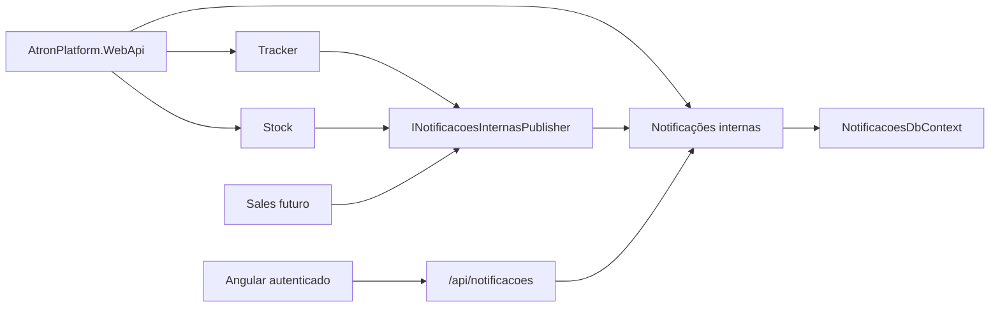

# ADR 0008: Incorporar notificações internas ao host da plataforma

## Status

Aceito e implementado em 27/07/2026.

Este ADR substitui a topologia distribuída, o cliente HTTP interno e a
autenticação de serviço definidos pelo ADR 0005. Permanecem válidas no ADR 0005
a fronteira funcional, os contratos, a propriedade do conteúdo pelos módulos
produtores, o `NotificacoesDbContext`, as migrations e as regras de leitura e
exclusão lógica.

## Contexto

O ADR 0005 extraiu notificações internas do Tracker para impedir que Stock e
Sales dependessem de entidades, repositórios ou persistência daquele módulo. A
extração comprovou a fronteira, mas também criou um segundo processo HTTP,
segredos entre serviços, URL própria, autenticação de serviço e necessidade de
deploy coordenado.

O ADR 0007 consolidou Tracker, Stock e Auditoria no
`AtronPlatform.WebApi`. Nesse cenário, manter AtronNotificacoes em outro
processo não oferece uma necessidade comprovada de escala, equipe, isolamento
ou ciclo de publicação independente. A topologia aumenta o custo operacional e
o consumo da hospedagem sem agregar autonomia real ao produto atual.

Incorporar a capacidade ao Platform não significa devolver notificações ao
Tracker. A fronteira transversal continua necessária para que todos os módulos
publiquem por um contrato neutro.

## Decisão

`AtronPlatform.WebApi` será o único host executável do Atron. Notificações
internas serão compostas no mesmo processo por
`AddNotificacoesInternasCapability`.

A capacidade continuará proprietária de:

- contratos de publicação e consulta;
- aplicação e regras de leitura;
- entidade e repositório;
- `NotificacoesDbContext`;
- tabela `Notificacoes`, sequence e histórico
  `__AtronNotificacoesMigrationsHistory`;
- migrations em `Framework/AtronNotificacoes/Infrastructure/Migrations`;
- métricas e teste de prontidão do banco.

Tracker, Stock e o futuro Sales continuarão publicando por
`INotificacoesInternasPublisher`. A implementação passa a ser in-process e cria
um escopo próprio com a transação ambiente suprimida. Portanto, a persistência
da notificação não participa da transação do produtor e uma falha permanece
consultiva.

O endpoint interno `POST /api/notificacoes/publicacoes`, o token de serviço e o
cliente HTTP serão removidos. Eles não são necessários para uma colaboração
dentro do mesmo processo.

As rotas consumidas pelo Angular permanecem:

- `GET /api/notificacoes`;
- `POST /api/notificacoes/{id}/marcar-como-lida`;
- `POST /api/notificacoes/marcar-todas-como-lidas`;
- `DELETE /api/notificacoes/{id}`;
- `GET /api/notificacoes/prontidao`.

Essas rotas são publicadas pelo host neutro e usam o JWT normal da plataforma.
A policy `UsuarioDeNotificacoes` continua exigindo o claim `CodigoUsuario`.
O Angular passa a usar a mesma `apiRoute` dos demais módulos.

`GET /api/saude` continua sendo a verificação anônima de vida do processo e não
consulta o banco de notificações. `GET /api/notificacoes/saude` verifica apenas
o `NotificacoesDbContext` e exige autenticação.

### Visão arquitetural

## Consequências

### Positivas

- existe um único build, processo, URL e deploy;
- desaparecem o segredo e o token entre serviços;
- publicação interna não depende de rede ou cold start de outro serviço;
- as rotas do Angular não mudam;
- a fronteira e a propriedade de dados de notificações permanecem explícitas;
- a capacidade continua pronta para futura extração porque os produtores usam
  contrato e não o serviço ou o DbContext diretamente.

### Trade-offs aceitos

- uma falha fatal do processo afeta também notificações;
- uma alteração na capacidade publica o monólito inteiro;
- a separação deixa de ser garantida por rede e passa a depender de contratos,
  direção de referências e testes arquiteturais;
- uma extração futura precisará reintroduzir um adaptador de transporte.

## Alternativas consideradas

### Manter o host independente

Rejeitada no estágio atual. Preserva um laboratório distribuído, mas exige
outro deploy, URL, segredo, monitoramento e coordenação sem necessidade
operacional comprovada.

### Incorporar tudo ao Tracker

Rejeitada. Reduz projetos, mas transforma uma capacidade usada por vários
módulos em detalhe do Tracker e reabre o acoplamento que o ADR 0005 removeu.

### Compartilhar o DbContext de notificações com outro módulo

Rejeitada. Unidade de processo não altera propriedade de dados. As migrations e
o contexto continuam exclusivos da capacidade.

## Evidências da implementação

- o host `AtronNotificacoes` foi removido da solução;
- o Platform registra `AddNotificacoesInternasCapability`;
- o publicador HTTP e o cliente HTTP de consulta foram removidos;
- os controllers de consulta e prontidão estão em
  `AtronPlatform/WebApi/Controllers/Transversais`;
- testes cobrem composição, rotas, autorização, publicação in-process e
  supressão da transação ambiente;
- o contrato de banco e as migrations existentes não foram alterados.

## Relação com outros ADRs

- ADR 0003 continua governando resources e textos observáveis.
- ADR 0005 continua governando a fronteira funcional e os dados, mas tem sua
  topologia HTTP substituída por este ADR.
- ADR 0007 continua governando o host neutro e passa a incluir Notificações
  Internas entre as capacidades in-process.
