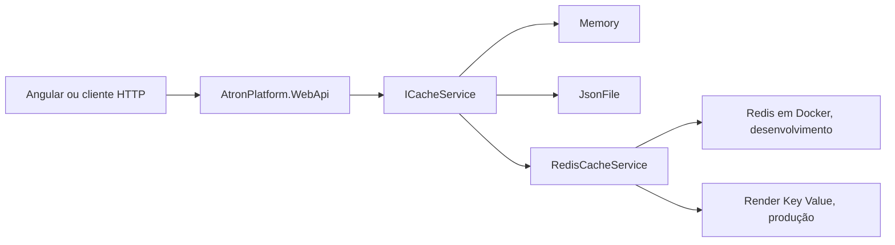

# Cache Redis no Atron

## Objetivo

Este guia descreve como executar, configurar, validar e operar o cache Redis
compatível do Atron nos ambientes local e publicado.

A adoção não transforma o Atron em microsserviço. O produto continua sendo um
monólito modular publicado pelo `AtronPlatform.WebApi`. Redis é uma dependência
externa e transversal usada por meio do contrato `ICacheService`.

A decisão arquitetural e seus trade-offs estão registrados no
[ADR 0009](adr/transversais/0009-adotar-redis-como-cache-distribuido.md).

## Por que o Atron usa Redis

O Atron já possuía três características que justificavam um provider
distribuído:

1. dados de acesso e autorização eram armazenados em cache;
2. recuperação de senha e primeiro acesso usavam dados temporários com TTL;
3. os consumidores já dependiam de `ICacheService`, sem conhecer a tecnologia
   concreta.

`IMemoryCache` atende uma única execução, mas cada instância da WebApi mantém
seu próprio conteúdo e perde tudo quando o processo reinicia. Redis mantém o
cache fora do processo e permite que mais de uma instância consulte as mesmas
chaves.

O objetivo de formação técnica faz parte do Atron, mas não é a única
justificativa. A mudança exercita uma necessidade real de aplicações
publicadas: configuração por ambiente, serialização, TTL, invalidação,
dependência de rede e compartilhamento de estado efêmero.

## Fluxo implementado



Responsabilidades:

| Componente | Responsabilidade |
|---|---|
| `ICacheService` | Contrato usado pelos casos de uso e pela autorização. |
| `ChaveCache` | Montagem centralizada de chaves como `acesso:QRZ`. |
| `CacheService` | Provider local em memória. |
| `JsonFileCacheService` | Provider local em arquivo JSON. |
| `RedisCacheService` | Serialização e acesso ao `IDistributedCache`. |
| `AddAtronCache` | Seleção de um único provider pela configuração. |

O prefixo configurado por ambiente é acrescentado pelo provider Redis. Uma
chave lógica `acesso:QRZ` aparece localmente como
`atron:dev:acesso:QRZ` e em produção como `atron:prod:acesso:QRZ`.

## Configuração base

O `appsettings.json` versionado usa `Memory` como padrão seguro. Dessa forma, a
aplicação não exige uma conexão externa apenas para iniciar:

```json
{
  "Cache": {
    "Provider": "Memory",
    "JsonFile": {
      "Diretorio": "App_Data/cache-json"
    },
    "Redis": {
      "InstanceName": "atron:"
    }
  }
}
```

Ambientes que adotam Redis sobrescrevem o provider e a conexão. Strings de
conexão e credenciais não são versionadas.

## Execução local com Docker Compose

### Pré-requisitos

- Docker Desktop iniciado;
- containers Linux habilitados;
- porta local `6379` disponível.

O arquivo `compose.redis.yaml` executa somente a dependência Redis. Ele não
executa a WebApi nem representa a topologia do Render.

Se o container `atron-redis` foi criado anteriormente com `docker run`, pare-o
antes de usar o Compose para liberar a porta:

```powershell
docker stop atron-redis
```

Suba o Redis a partir da raiz do repositório:

```powershell
docker compose -f compose.redis.yaml up -d
```

Valide o estado e o health check:

```powershell
docker compose -f compose.redis.yaml ps
docker compose -f compose.redis.yaml exec redis redis-cli PING
```

Resultado esperado:

```text
PONG
```

O Compose publica a porta somente em `127.0.0.1`, não cria volume e desabilita
persistência. Essa configuração é intencional: o conteúdo é cache e deve poder
ser reconstruído pela aplicação.

Para interromper:

```powershell
docker compose -f compose.redis.yaml stop
```

Para remover o container e a rede criados pelo Compose:

```powershell
docker compose -f compose.redis.yaml down
```

## Configuração local da WebApi

O projeto `AtronPlatform.WebApi` já possui `UserSecretsId`. Configure:

```powershell
dotnet user-secrets set "Cache:Provider" "Redis" --project AtronPlatform/WebApi/AtronPlatform.WebApi.csproj
dotnet user-secrets set "Cache:Redis:ConnectionString" "localhost:6379,abortConnect=false" --project AtronPlatform/WebApi/AtronPlatform.WebApi.csproj
dotnet user-secrets set "Cache:Redis:InstanceName" "atron:dev:" --project AtronPlatform/WebApi/AtronPlatform.WebApi.csproj
```

Confira as chaves configuradas sem copiar valores para documentação ou logs:

```powershell
dotnet user-secrets list --project AtronPlatform/WebApi/AtronPlatform.WebApi.csproj
```

Quando a WebApi é executada diretamente pelo Visual Studio ou por `dotnet run`,
`localhost:6379` aponta para a porta publicada pelo container Redis.

Se a WebApi também for executada dentro de um container Docker separado,
`localhost` passa a representar o próprio container da WebApi. No Docker
Desktop, use `host.docker.internal:6379` para alcançar a porta publicada no
host, ou coloque os dois serviços na mesma rede Compose e use `redis:6379`.

## Validação funcional local

1. inicie Redis;
2. inicie a WebApi;
3. autentique um usuário de teste;
4. chame `GET /api/Sessao/Info`;
5. liste as chaves:

```powershell
docker compose -f compose.redis.yaml exec redis redis-cli --scan --pattern "atron:dev:*"
```

Consulte o TTL de uma chave encontrada:

```powershell
docker compose -f compose.redis.yaml exec redis redis-cli TTL "atron:dev:acesso:QRZ"
```

Interpretação:

- valor positivo: chave existente com expiração em segundos;
- `-1`: chave existente sem expiração, resultado inesperado para esses fluxos;
- `-2`: chave inexistente.

Valide também:

- cache miss seguido de gravação;
- cache hit na segunda leitura;
- chave disponível após reiniciar somente a WebApi;
- invalidação após alterar o perfil de acesso;
- expiração e reconstrução da chave;
- remoção de dados temporários depois do uso.

Não use `FLUSHALL` em ambiente compartilhado. Remova somente chaves de teste
com nome conhecido.

## Configuração no Render

### Criar o serviço

No Dashboard do Render:

1. selecione `New > Key Value`;
2. escolha o mesmo workspace e a mesma região da WebApi;
3. selecione `allkeys-lru` para o uso como cache;
4. mantenha a persistência desligada quando o conteúdo for descartável;
5. crie o serviço e copie a `Internal Key Value URL`.

Uma URL interna sem autenticação tem formato semelhante a:

```text
redis://red-exemplo:6379
```

A configuração atual do StackExchange.Redis usa o formato tokenizado. Remova o
prefixo `redis://` e acrescente a opção de reconexão:

```text
red-exemplo:6379,abortConnect=false
```

Se a autenticação interna for habilitada futuramente, usuário e senha deverão
ser configurados de acordo com o formato do StackExchange.Redis. Não registre
esses valores em documentação ou no Git.

### Variáveis da WebApi

Em `AtronPlatform.WebApi > Environment`, configure:

```text
Cache__Provider=Redis
Cache__Redis__ConnectionString=red-exemplo:6379,abortConnect=false
Cache__Redis__InstanceName=atron:prod:
```

Escolha `Save and deploy`. User Secrets locais não são publicados no Render.

### Por que o Dockerfile não muda

O Dockerfile da raiz continua publicando e executando apenas
`AtronPlatform.WebApi.dll`. Ele já restaura o pacote NuGet adicionado ao
`Shared.csproj` durante `dotnet restore`.

Redis não deve ser instalado nessa imagem porque:

- WebApi e cache possuem processos e ciclos de vida diferentes;
- o Render fornece o Key Value como serviço separado;
- atualizações e reinícios do host não devem administrar o processo Redis;
- colocar os dois no mesmo container impediria escala e operação independentes.

O Render conecta os serviços pela URL interna e pelas variáveis de ambiente.

## Validação no Render

Depois do deploy:

1. confirme que o deploy não apresenta erro de configuração ou DI;
2. confirme `GET /api/saude` com status `200`;
3. faça login e chame `GET /api/Sessao/Info`;
4. observe conexões, memória e comandos nas métricas do Key Value;
5. confirme o prefixo `atron:prod:`;
6. reinicie somente a WebApi e repita a consulta;
7. altere um perfil de teste e confirme a invalidação da chave;
8. verifique que logs não exibem a conexão.

`/api/saude` prova hoje a vida do processo, mas não é um health check específico
de Redis. Um readiness check do cache permanece uma evolução separada.

## Limites e política de falha atuais

- Redis não é fonte de verdade para usuários, perfis, tarefas ou estoque.
- Perder chaves de acesso deve causar reconstrução a partir do banco.
- Perder dados temporários pode invalidar links de recuperação ou primeiro
  acesso; o usuário precisará solicitar um novo link.
- A implementação atual propaga indisponibilidade e timeout do Redis. Uma
  política explícita de fallback e observabilidade ainda precisa ser definida
  antes de declarar alta disponibilidade.
- Invalidação de autorização é sensível: ignorar silenciosamente uma falha de
  remoção pode manter permissões antigas até o TTL expirar.
- Pub/Sub, Streams, filas, locks distribuídos e rate limiting não fazem parte
  desta decisão.

## Quando não usar Redis

Não use Redis apenas porque a tecnologia é comum no mercado. Evite-o quando:

- a consulta já é barata e pouco frequente;
- existe apenas uma instância e `IMemoryCache` atende o requisito;
- o dado precisa de durabilidade e consistência como fonte oficial;
- não há estratégia de TTL ou invalidação;
- o custo operacional e de rede supera o ganho medido;
- o sistema não consegue reconstruir o dado descartado.

## Rollback do provider

Para voltar ao cache em memória sem alterar código, configure:

```text
Cache__Provider=Memory
```

Faça novo deploy e valide login, sessão e autorização. As chaves existentes no
Key Value podem expirar naturalmente. O rollback troca o provider, mas não
remove a dependência NuGet nem a implementação Redis.

## Referências

- Render Key Value: <https://render.com/docs/key-value>
- Variáveis de ambiente no Render: <https://render.com/docs/configure-environment-variables>
- StackExchange.Redis, configuração: <https://stackexchange.github.io/StackExchange.Redis/Configuration.html>
- ASP.NET Core, cache distribuído: <https://learn.microsoft.com/aspnet/core/performance/caching/distributed>
